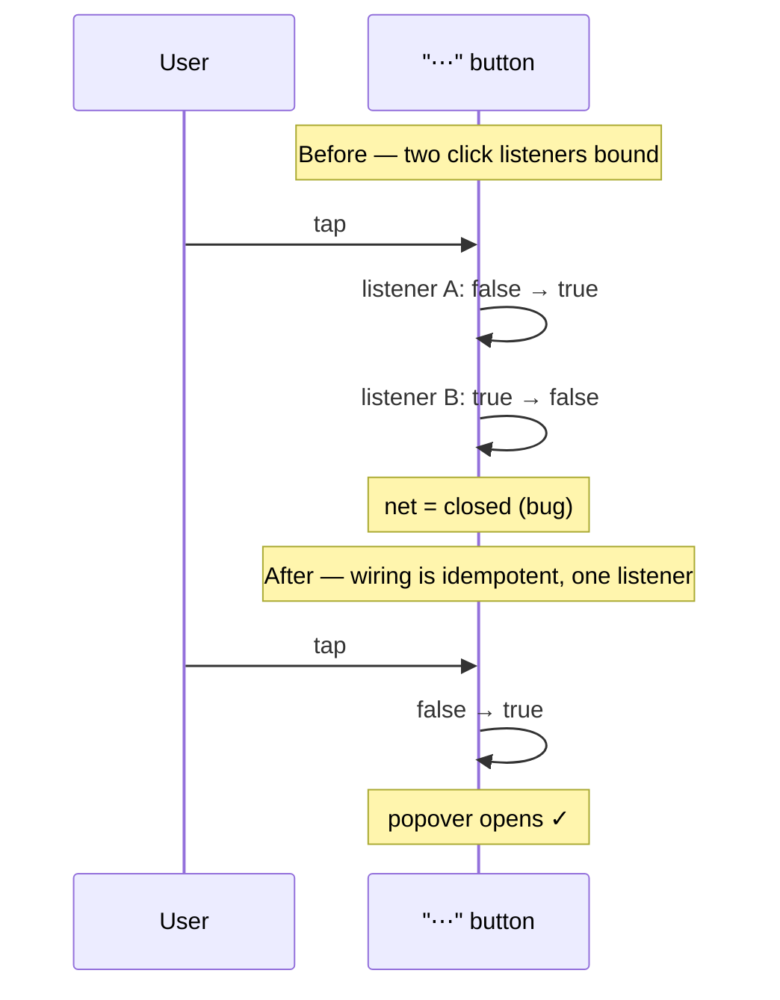

# Fix trace-nav "⋯" overflow popover not revealing on mobile

## Summary

On the mobile detail view the trace-nav "⋯" (More actions) button did nothing
when tapped — the popover never revealed **Observations**, **🧠** and
**Synapses ⇄**. Closes #383.

**Root cause:** `initTraceOverflowMenu()` was invoked **twice** — once
standalone (`docs/app.js`) and again via `initCompactTraceNav()`. Each call
attached its own `click` listener to the "⋯" button, and each listener toggled
`data-overflow-open`. A single tap fired **both** listeners, so the state went
`false → true → false` and cancelled out: the popover never appeared.

### Fix

- Extracted the wiring into a new shared module
  `docs/shared/trace_overflow_menu.js` (`wireTraceOverflowMenu()`), which is
  now **idempotent** — a repeat call on the same wrapper is a no-op, so the
  popover reliably opens on the first tap no matter how many times the
  initialiser runs.
- Removed the redundant standalone `initTraceOverflowMenu()` call; the
  overflow menu is now wired exactly once via `initCompactTraceNav()`.
- Registered the new module in `docs/sw.js` `STATIC_FILES` so the service
  worker caches it (enforced by `tests/sw_static_files_test.ts`).
- Cleanup (per the issue's optional note): removed the dead
  `el.traceOverflow`, `el.traceOverflowToggle`, `el.traceOverflowMenu`
  lookups, which referenced IDs that never existed and were always `null`.

### Note on Synapses ⇄ on phone widths

`.synapsePanelToggle` is hidden by **pre-existing** CSS on phone viewports
(`docs/styles.css` — it is a tablet-only control, shown only at 640–1023px).
So on a 375px phone the popover correctly contains **Observations** + **🧠**;
**Synapses ⇄** joins them at tablet width where that control is visible. This
is existing behaviour and unchanged by this fix — the bug was purely the
popover failing to reveal on tap.

## Evidence

Captured at 375px (iPhone width, dark mode) via Playwright
(`scripts/verify_issue_383_overflow_popover.ts`).

Collapsed — "⋯" shown, popover closed:

After a single tap — popover reveals the secondary actions:

## Test Plan

- Added `tests/trace_overflow_menu_test.ts` — exercises the real wiring with a
  parsed DOM and genuine dispatched `click` events:
  - a single tap opens the popover (`data-overflow-open="true"`,
    `aria-expanded="true"`) — fails against the double-bound behaviour;
  - a second tap closes it;
  - wiring is **idempotent** — double init still opens on the first tap
    (regression guard for the exact #383 cause);
  - selecting a menu item closes the popover;
  - missing wrapper / summary is handled gracefully.
- Full quality gate passes: `./quality.sh` → 779 passed / 0 failed
  (`deno fmt --check`, `deno lint`, type check, tests).
