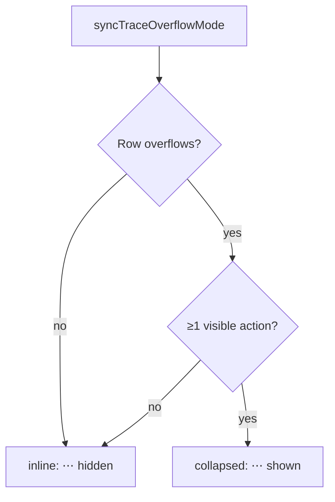

# Only show the trace-nav "⋯" overflow button when it has ≥1 visible action

## Summary

The trace-nav `⋯` "More actions" button's visibility was driven **purely by
a width measurement** (`shouldCollapseTraceOverflow()`): whenever the trace
bar's children didn't fit, the wrapper switched to
`data-overflow-mode="collapsed"` and `⋯` was shown — regardless of whether
the overflow menu actually had any visible actions to reveal.

This change gates `⋯` visibility on there being **≥1 visible overflow
action**. When the menu would be empty (no visible `role="menuitem"`
children), inline mode is forced so the summary stays hidden via the
existing `display:none` CSS and `⋯` is **not rendered** (rather than left
as an inert button).

This is a **defensive** guard: today all three menu items (`#obsBtn`,
`#graphBtn`, `#synapsePanelToggle`) are statically populated and never
conditionally hidden, so the visible layout is unchanged. The guard
directly implements the requested behaviour and prevents a future inert
`⋯` if any of those actions later becomes conditionally hidden.

Closes #384.

## Changes

- **`docs/shared/trace_header.js`** — added a pure, DOM-free helper
  `hasOverflowActions({ visibleActionCount })` next to
  `shouldCollapseTraceOverflow()`. Returns `true` only when there is ≥1
  visible action; invalid/missing/negative counts fall back to `false`.
- **`docs/app.js`**:
  - Added `countVisibleOverflowActions(wrapper)` which counts
    `.traceOverflowMenu [role="menuitem"]` children, skipping
    `display:none` (mirrors the visibility pattern already used by
    `sumTraceBarChildrenWidth`/`countTopLevelFlexItems`).
  - In `syncTraceOverflowMode()`, the next mode is now
    `collapsed` only when the width measurement says collapse **and**
    `hasOverflowActions()` is true; otherwise inline.
- **`docs/archive/pr-summaries/pr-summary-383.md`** — whitespace-only
  `deno fmt` fix to a pre-existing file merged from sibling PR #385, to
  keep the quality gate green.

## Behaviour



## Acceptance criteria

- Overflow menu has ≥1 visible action and the row overflows → `⋯` shows and
  reveals them (unchanged from today). ✅
- Overflow menu has 0 visible actions → `⋯` is **not rendered** in any
  viewport/mode (no inert/disabled button left behind). ✅
- The inline (wide) layout is unchanged. ✅

## Evidence

No web interface could be screenshotted — Playwright MCP was unavailable in
this run, and the change is behaviourally **defensive** (today's menu always
has three visible items, so the visible layout is identical). The fix is
verified by unit tests on the new pure helper:

```
hasOverflowActions true when at least one visible action ... ok
hasOverflowActions false when zero visible actions ... ok
hasOverflowActions false for invalid input ... ok
ok | 21 passed | 0 failed
```

`./quality.sh` passes cleanly: **782 passed | 0 failed**.

## Test Plan

Added `Deno.test` cases to `tests/trace_header_test.ts` for the new pure
helper, following the style of the existing `shouldCollapseTraceOverflow`
tests:

- `hasOverflowActions true when at least one visible action` — `1` and `3`
  actions → `true`.
- `hasOverflowActions false when zero visible actions` — `0` actions →
  `false` (the `⋯` gate).
- `hasOverflowActions false for invalid input` — `null`, `undefined`, `{}`,
  `NaN`, and negative counts → `false`.
