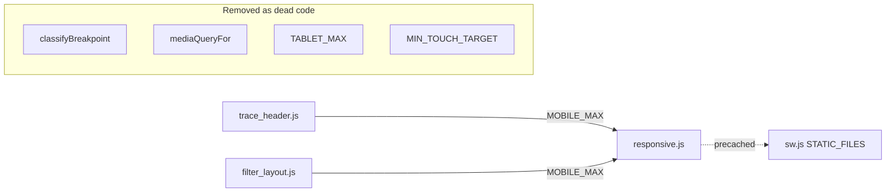

# PR Summary — Issue #395

## Summary

Issue #395 reported `docs/shared/responsive.js` as a whole-module dead-code
orphan and asked to delete the module and its test. Investigation showed the
premise was **partly inaccurate**: the module is _not_ a whole-module orphan —
two production modules import it.

- `docs/shared/trace_header.js` imports `MOBILE_MAX`
- `docs/shared/filter_layout.js` imports `MOBILE_MAX`

Both use `MOBILE_MAX` as their collapse threshold, so deleting the module would
break production. The genuinely-dead symbols were the other four exports:
`classifyBreakpoint`, `mediaQueryFor`, `TABLET_MAX` and `MIN_TOUCH_TARGET` —
referenced only by `tests/responsive_test.ts`.

Changes:

- **Removed** the four unused exports from `docs/shared/responsive.js`, keeping
  `MOBILE_MAX` as the single source of truth for the layout helpers, and updated
  the module docstring (which had stale "consumed by both CSS and JS" wording).
- **Trimmed** `tests/responsive_test.ts` to the surviving `MOBILE_MAX` test.
- **Added** `./shared/responsive.js` to the `STATIC_FILES` precache manifest in
  `docs/sw.js`. It is a transitive dependency of the already-precached
  `filter_layout.js` and `trace_header.js`, so its omission was a latent
  offline-loading bug (the existing `sw_static_files_test.ts` only checks
  _direct_ `app.js`/`graph.js` imports, which is why the gap was missed).

`tests/lint_coverage_test.ts` still lists `responsive.js` — the module survives,
so no change was needed there.

Closes #395

## Evidence

Backend/module change with no UI surface — verified via the test suite.

- `deno fmt --check`, `deno lint` clean on all three changed files.
- Full suite: **771 passed, 0 failed**.
- Symbol grep confirmed `classifyBreakpoint`, `mediaQueryFor`, `TABLET_MAX` and
  `MIN_TOUCH_TARGET` have no references outside the now-trimmed test.

### Pre-existing quality-gate note

`./quality.sh` reports 6 `deno fmt` failures in files **untouched by this PR**
(`docs/index.html`, `docs/styles.css`, `docs/graph/graph.css`,
`docs/starfield/index.html`, `docs/starfield/starfield.css`,
`docs/evidence/loading-fix-evidence.html`). These fail identically on the clean
`Develop` base branch and are out of scope for this dead-code change, so they
were left untouched. All three files modified by this PR pass `deno fmt`,
`deno lint`, and tests cleanly.

## Test Plan

- `tests/responsive_test.ts` — reduced to the `MOBILE_MAX is 640` assertion (the
  only surviving export); tests for the removed symbols deleted.
- `tests/sw_static_files_test.ts`, `tests/pwa_test.ts` — pass with the new
  precache entry.
- `tests/trace_header_test.ts`, `tests/filter_layout_test.ts` — confirm the
  `MOBILE_MAX` consumers still behave correctly.
- Full suite: 771 passed, 0 failed.
