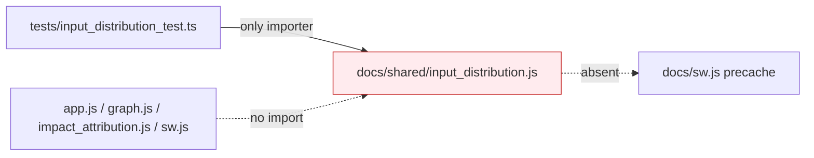

## Summary

Removed the dead-code module `docs/shared/input_distribution.js` and its
unit test. Module-graph analysis confirmed the module — and its three
exports `summariseInputDistribution`, `deriveLowRegimeThreshold` and
`buildInputDistributionMap` — was imported by **no production module**.
The only importer was `tests/input_distribution_test.ts`, the module was
absent from the `docs/sw.js` precache manifest, and nothing loaded it
dynamically by path.

The module's docstring referenced Issue #271 min-gate-awareness wiring in
the influence calc. That integration was **never landed**:
`docs/shared/graph_analysis.js` applies its own Issue #272 input-boundary
masking without importing this module, and no application `.js`
(`app.js`, `graph/graph.js`, `impact_attribution.js`, `sw.js`) references
any of the three exports. The module is a graph-level orphan, safe to
delete.

Closes #396.

## Changes

- Deleted `docs/shared/input_distribution.js` (orphan module).
- Deleted `tests/input_distribution_test.ts` (its only importer).
- Removed the `input_distribution.js` row from the README testable-module
  table and re-aligned the table via `deno fmt`.

## Evidence

CLI/dead-code change — no UI surface to screenshot. Verification is the
quality gate: `./quality.sh` passes cleanly after removal with
**756 passed | 0 failed** (the 15 tests in the deleted test file are gone;
no other test or source file referenced the module).

## Test Plan

- Ran `./quality.sh < /dev/null` (fmt + lint + full Deno test suite) —
  passes with 756 tests, confirming no remaining module imports or
  references to the deleted exports.
- Grep-verified no production `.js` imports `input_distribution`, the
  symbol names appear nowhere outside archived PR summaries, and the
  module is not in the `docs/sw.js` precache array.
