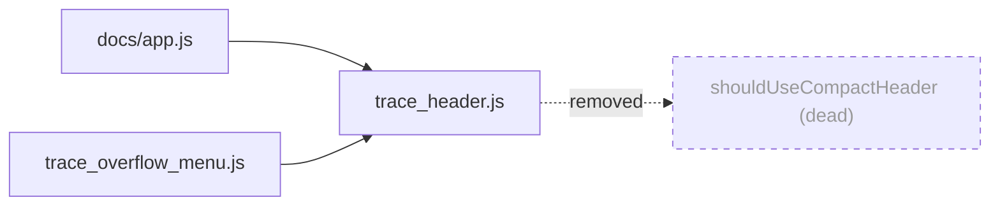

## Summary

Removed the unused export `shouldUseCompactHeader` from
`docs/shared/trace_header.js`. Module-graph analysis confirmed the symbol was
referenced only by `tests/trace_header_test.ts` — `docs/app.js` imports
`hasOverflowActions` and `shouldCollapseTraceOverflow` from the module (and
`nextOverflowState` is consumed by `docs/shared/trace_overflow_menu.js`), but
the compact-header decision was never wired into any application code. The
caveat in the issue (a pending mobile-header feature) was checked: no `docs/**`
source references `shouldUseCompactHeader`, `compactHeader`, or a compact-header
flag, so removal is safe and local to the module and its test.

The function's `MOBILE_MAX` import became unused once the function was deleted,
so that import was removed as well. The remaining exports (`formatTraceScore`,
`hasOverflowActions`, `nextOverflowState`, `shouldCollapseTraceOverflow`) are
unchanged.

Closes #399.

## Evidence

Backend/static-module change with no web UI surface to screenshot — the removed
function was a pure, DOM-free helper that no page ever called. Verified by the
full quality gate (`./quality.sh`):

- `deno fmt --check`, `deno lint`, and `deno check` pass.
- Test suite: **739 passed | 0 failed**.

A whole-repo identifier search after the change finds no remaining reference to
`shouldUseCompactHeader` in any `.js`/`.ts` file (the only remaining mentions
are in historical archived PR summaries, which are documentation and
intentionally left untouched).

## Test Plan

- Edited `tests/trace_header_test.ts`: removed the import of
  `shouldUseCompactHeader` and its three `Deno.test` blocks (phone widths,
  at/above `MOBILE_MAX`, invalid inputs). No other tests were modified or
  commented out.
- Ran `./quality.sh < /dev/null` — all 739 tests pass, lint/format/type checks
  clean.
