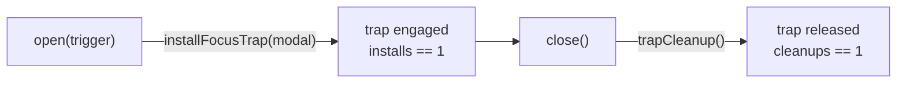

## Summary

The focus-trap test in `tests/topo_modal_test.ts` was a HOW-assertion: it reached
into the mock modal's internal `keydown` listener registry and counted listeners
to infer that `installFocusTrap` had been wired and torn down. That pinned the
*mechanism* (exactly one `keydown` listener on the modal element) rather than the
controller's observable responsibility — *"engage a focus trap while the modal is
open, release it on close"*. Any behaviour-preserving refactor of `installFocusTrap`
(e.g. a `focusin` handler, a document-level listener, or the `inert` attribute)
would have broken the test without any user-observable change.

This PR rewrites the test (option (a) from the issue) to assert on the observable
seam instead. The controller already accepts `installFocusTrap` as an injectable
dependency, so the test now passes a stub that returns a cleanup spy and asserts
the contract: `open()` engages the trap exactly once and `close()` releases it
exactly once. The trapping behaviour itself remains covered behaviourally by
`tests/modal_focus_test.ts`, so no observable coverage is lost.

Closes #408.

## Evidence

This is a test-only change (no UI or runtime behaviour changed). Verified via the
quality gate:

- `deno test tests/topo_modal_test.ts` → 9 passed / 0 failed.
- `./quality.sh` → 735 passed / 0 failed, `==> OK` (format, lint, type-check, tests).

The test now asserts on the `installFocusTrap`/cleanup contract (the box labels
above), not on the internal `keydown` listener count.

## Test Plan

- Rewrote `tests/topo_modal_test.ts::"createTopoModalController: focus trap is
  engaged on open, released on close"` to inject a stub `installFocusTrap` with a
  cleanup spy and assert `installs == 1` after `open()` and `cleanups == 1` after
  `close()`.
- No tests were deleted; the test count for the file is unchanged (9 tests).
- Ran the full `./quality.sh` gate — all checks pass.
