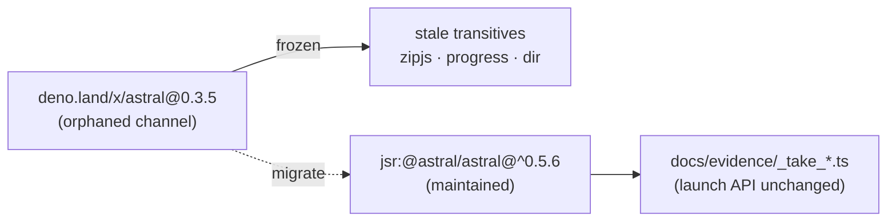

## Summary

Migrated the evidence/screenshot tooling off the **abandoned
`deno.land/x/astral` distribution channel** and onto the maintained JSR package
`@astral/astral`. The `deno.land/x` copy was frozen at `0.3.5` (published
2024-02-12); every fix and Deno/Chromium-compat update since then ships only on
JSR. Because the frozen `astral` also dragged in stale transitive `deno.land/x`
modules (`zipjs`, `progress`, `dir`), migrating the single import prunes those
too. Closes #414.

Changes:

- **`deno.json`** — added `"@astral/astral": "jsr:@astral/astral@^0.5.6"` to the
  `imports` map.
- **`docs/evidence/_take_screenshots.ts`**, **`_take_loading_screenshots.ts`**,
  **`_take_loading_fix.ts`** — changed the import from
  `https://deno.land/x/astral@0.3.5/mod.ts` to the bare `@astral/astral`
  specifier. The `launch` API is unchanged across the `0.3 → 0.5` line, so the
  screenshot scripts need no logic edits.
- **`deno.lock`** — regenerated so all `deno.land/x/astral` remote entries and
  their stale `deno.land/x` transitives (`zipjs`, `progress`, `dir`) are pruned;
  `jsr:@astral/astral@0.5.6` is now the sole resolution.

`@astral/astral` is an external (non-`stSoftwareAU`) JSR package; its latest
version `0.5.6` is long past the 24h quarantine window, so the JSR quarantine
gate clears it.

### Migration flow

## Evidence

Backend/CLI dependency migration — no web UI to screenshot. Verified by:

- `deno check docs/evidence/` exits cleanly (module resolves via JSR) — the
  existing `tests/evidence_scripts_check_test.ts` regression guard passes.
- New `tests/astral_jsr_migration_test.ts` (5 tests) confirms the JSR pin, the
  pruned lockfile, and the migrated imports.
- Full `./quality.sh` gate passes: fmt, lint, type-check, **740 tests, 0
  failed**.

## Test Plan

- Added `tests/astral_jsr_migration_test.ts`:
  - `deno.json pins @astral/astral to the JSR package`
  - `deno.lock has no orphaned deno.land/x/astral entries`
  - `deno.lock drops astral's stale deno.land/x transitives`
  - `deno.lock resolves the JSR astral specifier`
  - `evidence scripts import the JSR astral specifier, not deno.land/x`
- Existing `tests/evidence_scripts_check_test.ts` continues to pass, confirming
  the migrated imports type-check cleanly.
