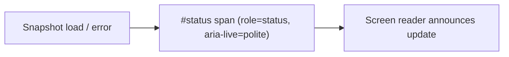

## Summary

The live status element on the starfield page —
`` in `docs/starfield/index.html` —
was missing the `role="status"` and `aria-live="polite"` attributes that the
identical element already carries on `docs/index.html` and
`docs/graph/index.html`. Without a live region, screen-reader users on the
starfield view got no spoken feedback when a snapshot loaded or failed — an
inconsistent, degraded experience that pa11y (WCAG2AA) does not flag.

Mirrored the other two pages by adding `role="status" aria-live="polite"` to
the starfield status span, so all three app-shell views announce snapshot
progress and errors consistently. Closes #420.

## Evidence

Accessibility-attribute change only — adding `role`/`aria-live` alters the
assistive-tech contract, not the rendered pixels, so there is no visual
difference to screenshot. The behaviour is verified instead by a new DOM test
that parses each entry HTML into a real document and asserts the live-region
attributes:

- Before the fix, `tests/status_live_region_test.ts` failed for
  `docs/starfield/index.html` (missing `role="status"`).
- After the fix, all three entry pages pass.

## Test Plan

- Added `tests/status_live_region_test.ts` — for `docs/index.html`,
  `docs/graph/index.html` and `docs/starfield/index.html`, asserts the
  `#status` element has `role="status"` and `aria-live="polite"`. This
  reproduces #420 (failed against the unfixed starfield page, passes now).
- `./quality.sh` passes cleanly: 743 tests, 0 failures.
