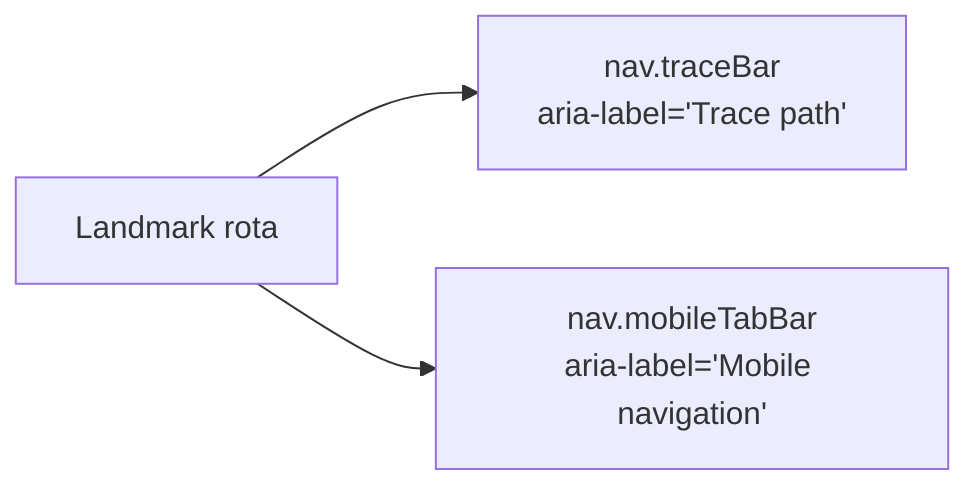

# Add distinguishing `aria-label` to the trace breadcrumb `<nav>`

## Summary

`docs/index.html` exposed two `<nav>` landmarks — the trace breadcrumb bar
(`.traceBar`) and the mobile bottom tab bar (`.mobileTabBar`). The mobile bar
carried `aria-label="Mobile navigation"`, but the trace bar had none.
Screen-reader users navigating by landmark saw two "navigation" regions with
only one named, so they could not distinguish the breadcrumb navigation from the
mobile tab navigation without exploring each in turn (HTML bucket check #6).

Added `aria-label="Trace path"` to the trace breadcrumb `<nav>` so each
duplicate landmark of the same type carries a unique accessible name.

Closes #422.

## Evidence

This is a non-visual accessibility change — adding an `aria-label` alters the
accessibility tree (the name announced by screen readers), not the rendered
pixels, so a screenshot would be identical before and after. Playwright MCP was
not available in this run.

Instead, the change is verified by a DOM-parsing test that loads the published
`docs/index.html` into a real parsed document and asserts the accessible name
directly:

- `nav.traceBar` now reports `aria-label="Trace path"`.
- Every `<nav>` landmark has a non-empty, **unique** `aria-label`.

## Test Plan

- Added `tests/trace_bar_nav_label_test.ts`:
  - `traceBar nav has a distinguishing aria-label` — asserts the breadcrumb
    `<nav>` carries `aria-label="Trace path"`. Fails against the unfixed markup.
  - `every <nav> landmark has a unique non-empty aria-label` — general
    regression guard: no unnamed or duplicate-named `<nav>` landmarks.
- Full quality gate: `./quality.sh` passes — 750 tests, 0 failures, format and
  lint clean.
