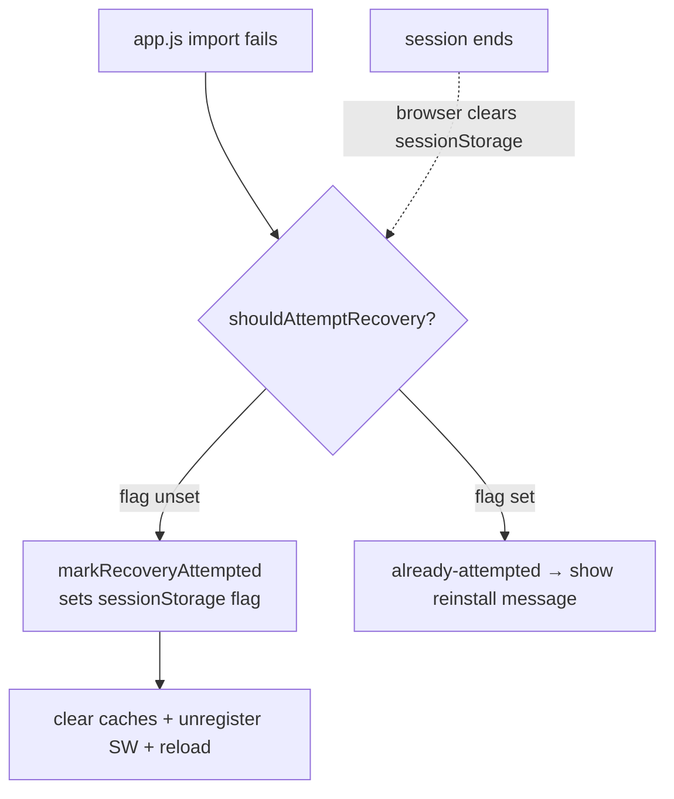

## Summary

Removed the unused export `clearRecoveryFlag` from `docs/shared/pwa_recovery.js`
(dead code). Closes #433.

The function had no production caller: `docs/boot.js` wires up
`recoverFromFailedAppLoad` (which internally uses `shouldAttemptRecovery` and
`markRecoveryAttempted`), but nothing ever called `clearRecoveryFlag`. Its only
reference was its own unit test.

### Caveat review — is the flag *meant* to be cleared on success?

The issue flagged a caveat: because the flag is never cleared,
`shouldAttemptRecovery` returns `false` after the first attempt. Confirmed this
is **intended**, so removal (not wiring up) is the correct fix:

- The recovery flag lives in **`sessionStorage`** (key
  `neatAiExplore_pwaRecoveryAttempt`), passed as `globalThis.sessionStorage` in
  `docs/boot.js`.
- The module's own documentation states the flag exists so we *"only attempt
  once per session"* and to *"prevent an infinite recovery loop"*.
- `sessionStorage` is cleared automatically by the browser when the session
  ends (tab/app close), so the once-per-session lifecycle needs **no explicit
  reset**. On a successful reload, the app simply never re-enters the recovery
  path; the stale flag is harmless and expires with the session.

No dynamic/reflective lookup references the symbol (it is not re-exported from
any barrel — the repo has no `mod.ts`/`index.ts`).

## Evidence

Backend/JS module change — no web UI to screenshot. Verified via the existing
`tests/pwa_recovery_test.ts` suite and the full quality gate.

`./quality.sh` passes cleanly: `757 passed | 0 failed`, format/lint/type checks OK.

## Test Plan

- Removed the now-obsolete `tests/pwa_recovery_test.ts::"clearRecoveryFlag
  removes the flag"` test and the `clearRecoveryFlag` import (business-logic
  change: the export it exercised no longer exists).
- Retained all other `pwa_recovery_test.ts` cases, which continue to verify the
  live recovery behaviour (`shouldAttemptRecovery`, `markRecoveryAttempted`,
  `recoverFromFailedAppLoad`, cache/SW clearing).
- `./quality.sh < /dev/null` → all 757 tests pass.
