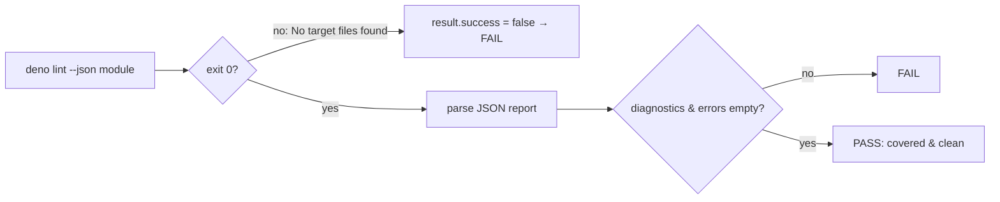

## Summary

Removed the brittle `result.stderr.includes("Checked 1 file")` assertions from
`tests/lint_coverage_test.ts`. Those eleven assertions scraped the exact wording
and stream (`stderr`) of Deno's human-readable `deno lint` summary line — a
HOW-test that a routine, behaviour-preserving Deno version bump (rewording the
summary to `1 file checked`, moving it to stdout, or localising it) would turn
red with no real regression.

The coverage tests now drive Deno's machine-readable `deno lint --json` surface
and assert against its stable schema (`diagnostics` / `errors` arrays) instead
of its prose. The genuine "module was not silently skipped" invariant is
preserved by `result.success`: passing an explicitly-excluded file to
`deno lint` exits non-zero (`error: No target files found.`), so a widened
`docs/**` exclusion still fails the tests loudly. The existing config-level
WHAT-test (`deno lint configuration excludes DOM-dependent files`) is unchanged
and continues to pin the exclusion list directly against `deno.json`.

Closes #442.

## Evidence

Backend/CLI test-only change — no web interface to screenshot.

**Behaviour verified against Deno 2.9.0:**

| Case                      | Exit           | stdout                                      | Detects skip?                |
| ------------------------- | -------------- | ------------------------------------------- | ---------------------------- |
| Clean, checked module     | 0 (`success`)  | valid JSON, `diagnostics: []`, `errors: []` | —                            |
| Excluded / skipped module | 1 (`!success`) | empty                                       | ✅ `result.success` is false |

**Regression proof.** Temporarily appending `docs/**` to `deno.json`'s
`lint.exclude` made all 11 module-coverage tests fail
(`FAILED | 1 passed |
11 failed`); restoring `deno.json` returned the suite to
green. This confirms the "not silently skipped" guarantee survives without
scraping the summary prose.

## Test Plan

- `tests/lint_coverage_test.ts` — all 12 tests pass (`deno test`): 9
  shared-module cases, 2 `impact_*` cases, plus the unchanged config-exclusion
  WHAT-test.
- Regression check: added `docs/**` to `lint.exclude` → 11 coverage tests fail
  as expected; reverted config → all pass.
- Full gate: `./quality.sh` → `756 passed | 0 failed`.
