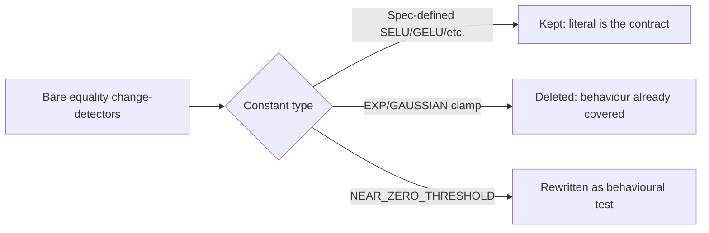

## Summary

Removed the magic-value change-detector assertions on internal
numerical-stability tuning constants in
`tests/impact_diagnostics_constants_test.ts`. The three bare equality cases —
`NEAR_ZERO_THRESHOLD is 1e-6`, `EXP_CLAMP_MAX is 50` and
`GAUSSIAN_CLAMP_MAX is 100` — pinned _arbitrary_ overflow/underflow guardrails
to the exact literals the code happens to use, with no spec justifying the
number. A behaviour-preserving retune of any of these would have turned the
assertion red with no real regression (anti-pattern #5). Closes #444.

Resolution mixes the two options the issue offered:

- **EXP_CLAMP_MAX / GAUSSIAN_CLAMP_MAX** — deleted the bare-equality cases. The
  file already covers their real contract behaviourally: _"EXP clamps extreme
  inputs to avoid Infinity"_ and _"GAUSSIAN clamps extreme inputs to avoid
  underflow"_ drive `squashDerivative` at extreme inputs and assert
  `Number.isFinite`, so no coverage is lost.
- **NEAR_ZERO_THRESHOLD** — had no other coverage, so the bare equality was
  replaced with a behavioural test that exercises what the constant guards:
  through `computeSquashDerivativeStats`, an IDENTITY neuron (derivative 1)
  reports `fracNearZero === 0` while a RELU neuron on non-positive inputs
  (derivative 0) reports `fracNearZero === 1`. This asserts the observable
  near-zero classification rather than the literal, so a behaviour-preserving
  retune of the threshold keeps the test green.

The spec-backed SELU/GELU/LEAKY-RELU/ELU constant tests are kept unchanged —
they encode published activation-function values, so the literal _is_ the
contract.

## Evidence

Backend/library change with no web interface to screenshot. Verified via the
test suite — the modified file runs 13 tests, all green, and the full quality
gate passes (`754 passed | 0 failed`).

## Test Plan

- Rewrote `NEAR_ZERO_THRESHOLD is 1e-6` →
  `NEAR_ZERO_THRESHOLD counts tiny
  derivatives as near-zero` in
  `tests/impact_diagnostics_constants_test.ts`, asserting `fracNearZero`
  classification via `computeSquashDerivativeStats`.
- Deleted `EXP_CLAMP_MAX is 50` and `GAUSSIAN_CLAMP_MAX is 100`; their
  behavioural clamp tests remain and still reference the constants.
- Ran `deno test tests/impact_diagnostics_constants_test.ts` → 13 passed.
- Ran `./quality.sh` → 754 passed, 0 failed.
