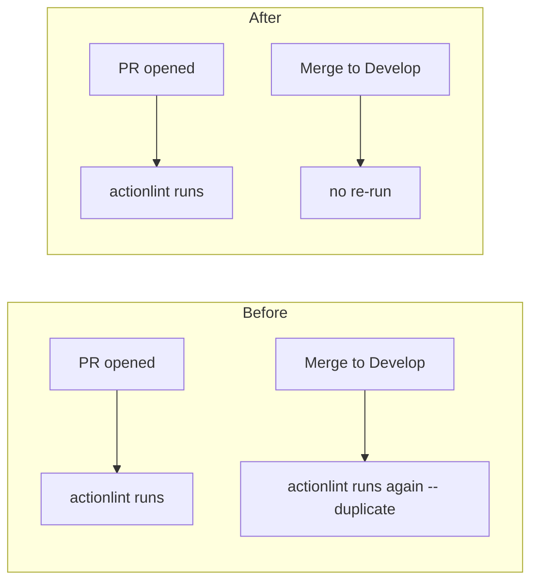

# Stop the actionlint checker re-running on push to `Develop`

## Summary

`.github/workflows/actionlint.yml` is a test/lint checker workflow that gates
pull requests, but it also triggered on `push:` to the default branch
(`Develop`, alongside `main`/`master`). Once it becomes a required status check,
every merge into the default branch re-runs the exact lint that already passed
on the PR — wasting runner minutes and risking a red tick on the default branch
for an already-green check.

This PR removes the `push:` trigger from `actionlint.yml`, keeping the
`pull_request` trigger (so it still gates every PR) and adding
`workflow_dispatch:` for manual re-runs. Deploy/publish/release workflows are
unaffected — they must keep firing on push; only this checker is narrowed.

Closes #453.

## Change

`on:` block, before → after:

- Before: `pull_request` + `push` to `[main, master, Develop]`
- After: `pull_request` + `workflow_dispatch` (no `push`)

## Evidence

Backend/CI-config change — no web interface to screenshot. Verified via the Deno
test suite (`./quality.sh`), which passes cleanly (756 tests).

New behavioural tests in `tests/workflow_actionlint_push_trigger_test.ts` parse
the workflow YAML and assert:

- `actionlint.yml` keeps its `pull_request` trigger (still gates PRs).
- `actionlint.yml` does not trigger on `push` to the default branch (`Develop`).

The push-trigger test fails against the unfixed workflow
(`push.branches=["main","master","Develop"]`) and passes after the fix.

## Test Plan

- Added `tests/workflow_actionlint_push_trigger_test.ts` (2 tests) — reproduces
  #453 and verifies the fix.
- Re-ran the existing workflow policy tests (`workflow_actionlint_gate_test.ts`,
  `workflow_concurrency_test.ts`) — the PR-gating and concurrency guarantees
  still hold.
- Ran `./quality.sh < /dev/null` — fmt, lint, type check, and all 756 tests
  pass.
