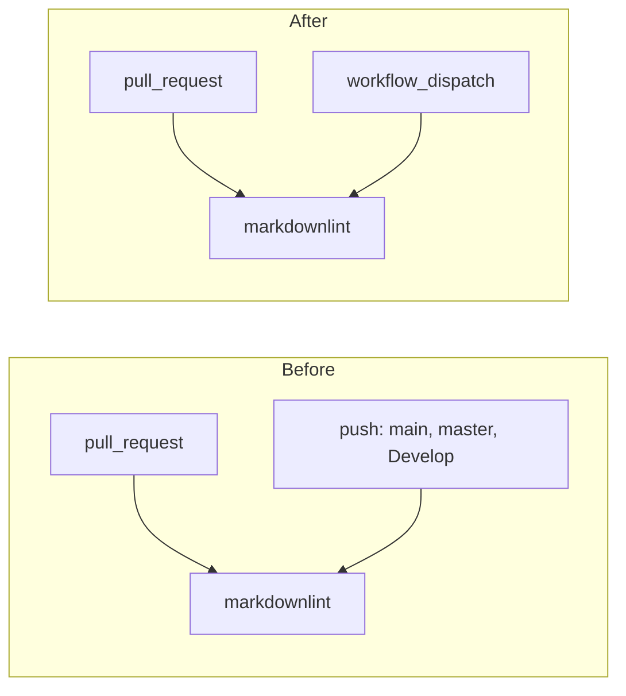

## Summary

`markdown-lint.yml` is a test/lint checker workflow, yet it still triggered on
`push:` to the default branch (`Develop`). Once it becomes a required status
check, every merge into `Develop` re-runs the exact lint that already gated the
pull request — wasting runner minutes and risking a red tick on the default
branch for a check that already passed.

This change drops the `push:` trigger so the workflow gates pull requests only,
mirroring the fix already applied to `actionlint.yml` (#453). A
`workflow_dispatch` trigger is kept so the lint can still be run on demand. The
`pull_request` trigger is unchanged, so PRs are still gated.

Closes #454.

## Change

`.github/workflows/markdown-lint.yml` `on:` block:

- Removed `push:` (which reached `Develop`, the default branch).
- Added `workflow_dispatch:` for manual runs.
- Kept `pull_request:` so the checker still gates PRs.

## Evidence

Backend/CI-only change — no web interface to screenshot. Verified via the new
unit tests and the full quality gate (`./quality.sh`): **758 passed, 0 failed**.

## Test Plan

Added `tests/workflow_markdown_lint_push_trigger_test.ts`:

- `markdown-lint.yml still gates pull requests (#454)` — asserts the object-form
  `on:` block keeps its `pull_request` trigger.
- `markdown-lint.yml does not re-run on push to the default branch (#454)` —
  asserts the `push:` branches list does not include `Develop` (passes when
  `push:` is absent entirely).

Both fail against the unfixed workflow (which listed `Develop` under
`push.branches`) and pass after the fix.
