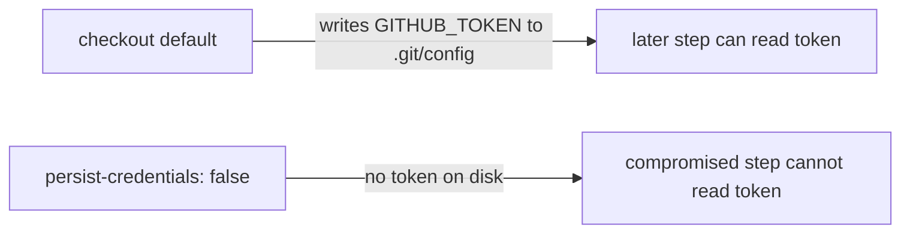

# Harden `a11y` checkout — do not persist the `GITHUB_TOKEN` (#455)

## Summary

The `a11y` job in `.github/workflows/a11y.yml` ran `actions/checkout` without
`persist-credentials: false`. By default checkout writes the workflow's
`GITHUB_TOKEN` into `.git/config` as an auth header, where any later step —
including a compromised dependency or injected script — can read it and act as
the token.

The `a11y` job only reads `docs/` to run accessibility checks (pa11y-ci against
a locally served copy of the static UI). It never pushes back to the repository
and fetches no private submodules, so the persisted credential is unnecessary
and only widens the blast radius of a compromised step. This PR adds
`persist-credentials: false` to the checkout step so the token is not written to
disk.

Closes #455.

## Evidence

Backend/CI-config change only — no web interface to screenshot. Verified via the
workflow-config test suite (Deno) and the full quality gate.

- Full quality gate: `760 passed | 0 failed`.
- New test file: `tests/workflow_a11y_persist_credentials_test.ts`
  - `a11y job checks out the repository (#455)` — ok
  - `a11y checkout does not persist the GITHUB_TOKEN to disk (#455)` — ok

## Test Plan

- Added `tests/workflow_a11y_persist_credentials_test.ts`, which parses
  `.github/workflows/a11y.yml` and asserts the `a11y` job's `actions/checkout`
  step sets `persist-credentials: false`. This fails against the unfixed
  workflow (no `with:` block) and passes after the fix.
- Ran `./quality.sh` — all 760 checks pass.
