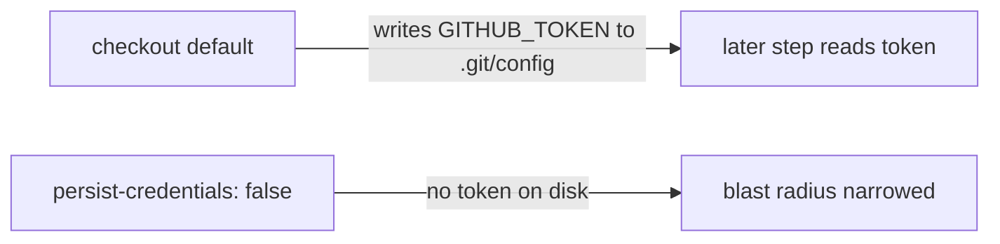

# Harden `actionlint` checkout — do not persist credentials

## Summary

The `actionlint` job's `actions/checkout` step ran without
`persist-credentials: false`, so `actions/checkout` wrote the workflow's
`GITHUB_TOKEN` into `.git/config` as an auth header. Any later step in the job —
including a compromised dependency or injected script — could read it and act as
the token. This job only reads `.github/workflows/*.yml` to lint them; it never
pushes back to the repo or fetches private submodules, so the persisted
credential is pure blast radius.

Added `persist-credentials: false` to the checkout step so the token is not
written to disk, matching the existing hardening on the `a11y` workflow (#455).

Closes #456.

## Evidence

Backend/CI change only — no web interface to screenshot. Verified via a new
YAML-parsing test that asserts the `actionlint` job's checkout sets
`persist-credentials: false`, and by the full `./quality.sh` gate.

Test run (before/after fix):

- Before fix:
  `actionlint checkout does not persist the GITHUB_TOKEN to disk (#456)` FAILED
- After fix: 2 passed | 0 failed
- Full gate: `ok | 762 passed | 0 failed`

## Test Plan

- Added `tests/workflow_actionlint_persist_credentials_test.ts`:
  - `actionlint job checks out the repository (#456)` — asserts the checkout
    step exists.
  - `actionlint checkout does not persist the GITHUB_TOKEN to disk (#456)` —
    reproduces the finding: fails against the unfixed workflow, passes after
    adding `persist-credentials: false`.
