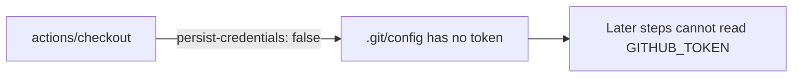

## Summary

The `quality` job in `.github/workflows/deno-quality.yml` checked out the
repository with `actions/checkout` but did not set `persist-credentials: false`.
By default `actions/checkout` writes the workflow's `GITHUB_TOKEN` into
`.git/config` as an auth header, where any later step in the job — including a
compromised dependency or an injected script — can read it and act as the token.

The `quality` job only reads the repository to run format, lint, type, and test
checks; it never pushes back to the repo or fetches private submodules, so the
persisted credential is unnecessary and only widens the blast radius of a
compromised step. This PR adds `persist-credentials: false` to the checkout step
so the token is not written to disk. Closes #457.

## Evidence

This is a CI/workflow configuration change with no web interface to screenshot.
Verified via a new parsing test (TDD): the test failed before the fix and passes
after.



Before/after of the affected step:

```yaml
# before
      - uses: actions/checkout@de0fac2e4500dabe0009e67214ff5f5447ce83dd

# after
      - uses: actions/checkout@de0fac2e4500dabe0009e67214ff5f5447ce83dd
        with:
          persist-credentials: false
```

## Test Plan

- Added `tests/workflow_deno_quality_persist_credentials_test.ts`, which parses
  `deno-quality.yml` and asserts the `quality` job's `actions/checkout` step
  sets `persist-credentials: false`. It reproduces #457 (failed against the
  unfixed workflow) and passes after the fix.
- `./quality.sh` passes cleanly (764 tests).
