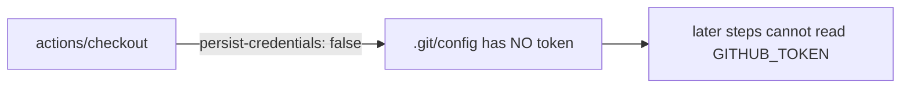

## Summary

Hardened the `quality` job in `.github/workflows/deno-quality.yml` so its
`actions/checkout` step no longer persists the workflow `GITHUB_TOKEN` to disk.

By default `actions/checkout` writes the `GITHUB_TOKEN` into `.git/config` as an
auth header, where any later step in the job — including a compromised
dependency or an injected script — can read it and act as the token. The
`quality` job only runs read-only checks (format, lint, type check, tests,
coverage upload) and never pushes back to the repo or fetches private
submodules, so the persisted credential is unnecessary and only widens the blast
radius of a compromised step. Adding `persist-credentials: false` applies
least-privilege and matches the pattern already used by `a11y.yml` and
`actionlint.yml`.

Closes #457.

## Evidence

Backend/CI-only change — there is no web interface to screenshot. Verification
was done via the workflow config test suite and YAML/actionlint validation:

- `actionlint .github/workflows/deno-quality.yml` → OK
- `./quality.sh` → `764 passed | 0 failed`

## Test Plan

- Added `tests/workflow_deno_quality_persist_credentials_test.ts`:
  - `quality job checks out the repository (#457)` — asserts the `quality` job
    has an `actions/checkout` step.
  - `quality checkout does not persist the GITHUB_TOKEN to disk (#457)` — parses
    the workflow YAML and asserts the checkout step sets
    `persist-credentials: false`. This regression test fails against the pre-fix
    workflow (where `with` was absent) and passes after the fix.
- Full suite: `764 passed | 0 failed`.
