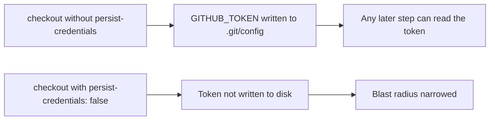

## Summary

The `audit` job in `.github/workflows/dependency-audit.yml` ran
`actions/checkout` without `persist-credentials: false`. By default checkout
writes the workflow's `GITHUB_TOKEN` into `.git/config` as an auth header, where
any later step — including a compromised dependency or injected script — could
read it and act as the token. The audit job only reads the lockfile and runs
`deno audit`; it never pushes back to the repo or fetches private submodules, so
the credential does not need to persist. Added `persist-credentials: false` to
the checkout step to narrow the blast radius of a compromised step.

Closes #458.

## Evidence

Backend/CI-only change — no web interface to screenshot. Verified via a new TDD
test that parses the workflow YAML and asserts the `audit` job's checkout step
sets `persist-credentials: false`. The test failed against the unfixed workflow
and passes after the fix; the full `./quality.sh` gate passes (764 tests).

## Test Plan

- Added `tests/workflow_dependency_audit_persist_credentials_test.ts`:
  - `audit job checks out the repository (#458)` — the `audit` job has an
    `actions/checkout` step.
  - `audit checkout does not persist the GITHUB_TOKEN to disk (#458)` —
    reproduces the finding: fails before the fix, passes after, asserting the
    checkout step sets `persist-credentials: false`.
- Confirmed existing workflow tests (`workflow_dependency_audit_test.ts`,
  `workflow_checkout_consistency_test.ts`) still pass.
- `./quality.sh < /dev/null` passes cleanly (764 passed, 0 failed).
