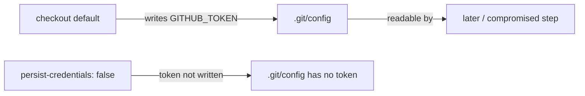

# Disable checkout credential persistence in `dependency-review`

## Summary

The `dependency-review` job in `.github/workflows/dependency-review.yml` ran
`actions/checkout` without `persist-credentials: false`. By default checkout
writes the workflow's `GITHUB_TOKEN` into `.git/config` as an auth header, where
any later step in the job — including a compromised dependency or an injected
script — can read it and act as the token. This job only checks out the
repository for `dependency-review-action`; it never pushes back to the repo or
fetches private submodules, so the persisted credential is unnecessary and only
widens the blast radius of a compromised step.

The fix adds `persist-credentials: false` to the checkout step, matching the
hardening already applied to the other workflows in this repo (`a11y.yml`,
`actionlint.yml`, `deno-quality.yml`, `dependency-audit.yml`). Closes #459.

## Evidence

Backend/CI-only change — no web interface to screenshot. Verified via the new
unit test and the full quality gate.

- New test fails against the unfixed workflow:
  `dependency-review checkout does not persist the GITHUB_TOKEN to disk (#459)
  ... FAILED` (missing `with.persist-credentials`).
- After the fix, `./quality.sh` passes cleanly: `ok | 768 passed | 0 failed`.

## Test Plan

- Added `tests/workflow_dependency_review_persist_credentials_test.ts`:
  - `dependency-review job checks out the repository (#459)` — asserts the job
    has an `actions/checkout` step.
  - `dependency-review checkout does not persist the GITHUB_TOKEN to disk
    (#459)` — parses the workflow YAML and asserts the checkout step sets
    `persist-credentials: false`. This reproduces the finding: it fails before
    the fix and passes after.
