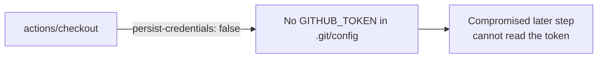

# Harden `deploy` checkout — do not persist the GITHUB_TOKEN (#460)

## Summary

The `deploy` job's `actions/checkout` step ran without
`persist-credentials: false`, so `actions/checkout` wrote the workflow's
`GITHUB_TOKEN` into `.git/config` as an auth header. Any later step in the job —
including a compromised dependency or an injected script — could read it and act
as the token. The `deploy` job only reads `docs/`, injects a build ID, generates
an SBOM and deploys to GitHub Pages; it never pushes back to the repository or
fetches private submodules, so the credential does not need to persist.

Added `persist-credentials: false` to the checkout step so the token is not
written to disk, narrowing the blast radius of any compromised step.

Closes #460.

## Evidence

Backend/CI-only change — no web interface to screenshot. Verified via the new
YAML-parsing test which asserts the `deploy` job's checkout step sets
`persist-credentials: false`, plus the full quality gate (`./quality.sh`,
770 tests passing).

## Test Plan

- Added `tests/workflow_deploy_persist_credentials_test.ts`:
  - `deploy job checks out the repository (#460)` — confirms the checkout step
    still exists.
  - `deploy checkout does not persist the GITHUB_TOKEN to disk (#460)` —
    reproduces the finding: fails against the unfixed workflow, passes after
    `persist-credentials: false` is added.
- `./quality.sh < /dev/null` — all 770 tests pass, including `actionlint`.
