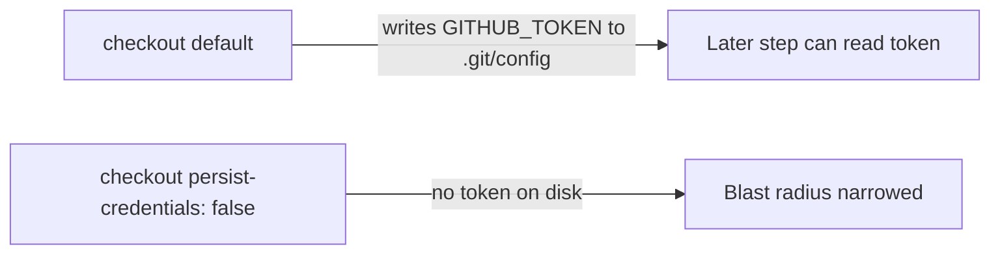

## Summary

Hardened the `markdownlint` job in `.github/workflows/markdown-lint.yml` against
credential leakage. The `actions/checkout` step ran without
`persist-credentials: false`, so by default `checkout` wrote the workflow's
`GITHUB_TOKEN` into `.git/config` as an auth header — where any later step in
the job (a compromised dependency or injected script) could read it and act as
the token. This job only lints Markdown; it never pushes back to the repository
or fetches private submodules, so the persisted credential is unnecessary and
only widens the blast radius of a compromised step.

Added `with.persist-credentials: false` to the checkout step so the token is not
written to disk. Fixes #461. Closes #461.

## Evidence

Backend/CI-config change — no web interface to screenshot. Verified via the new
YAML-parsing unit tests and the full quality gate:

- `deno test tests/workflow_markdown_lint_persist_credentials_test.ts` — 2
  passed.
- `./quality.sh` — `772 passed | 0 failed`, `==> OK`.

The new test fails against the unfixed workflow (no `with` block / no
`persist-credentials` key) and passes after adding `persist-credentials: false`,
giving a regression guard.

## Test Plan

- Added `tests/workflow_markdown_lint_persist_credentials_test.ts`:
  - `markdownlint job checks out the repository (#461)` — asserts the job has an
    `actions/checkout` step.
  - `markdownlint checkout does not persist the GITHUB_TOKEN to disk (#461)` —
    parses the workflow YAML and asserts the checkout step sets
    `persist-credentials: false`.
- Follows the existing `workflow_*_persist_credentials_test.ts` pattern used for
  the actionlint, deploy, deno-quality, dependency-review, dependency-audit and
  a11y workflows.
