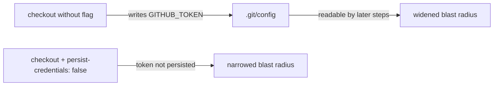

## Summary

The `semgrep` job's `actions/checkout` step ran without
`persist-credentials: false`, so the workflow's `GITHUB_TOKEN` was written into
`.git/config` as an auth header where any later step in the job could read it.
The job only checks out the repo to scan it — it never pushes back or fetches
private submodules — so the persisted credential was unnecessary blast radius.
Added `with.persist-credentials: false` to the checkout step. Closes #462.

## Evidence

Backend/CI change — no web interface to screenshot. Verified via a new Deno
test that parses `.github/workflows/semgrep.yml` and asserts the `semgrep` job's
checkout step sets `persist-credentials: false`.



Test output:

```
running 2 tests from ./tests/workflow_semgrep_persist_credentials_test.ts
semgrep job checks out the repository (#462) ... ok
semgrep checkout does not persist the GITHUB_TOKEN to disk (#462) ... ok
```

`./quality.sh` passes cleanly: `776 passed | 0 failed`.

## Test Plan

- Added `tests/workflow_semgrep_persist_credentials_test.ts`:
  - Asserts the `semgrep` job has an `actions/checkout` step.
  - Asserts that checkout step sets `persist-credentials: false`. This test
    fails against the unfixed workflow and passes after the fix.
