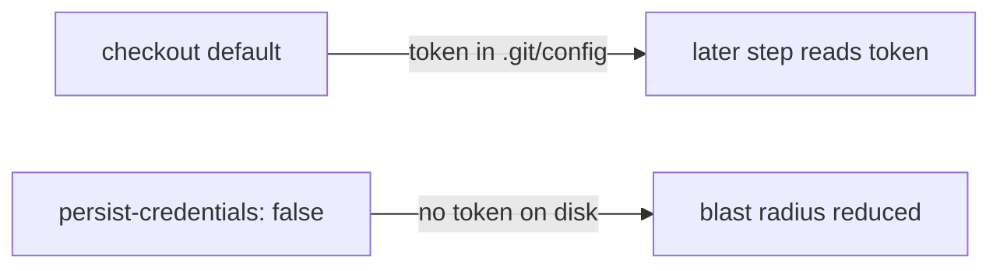

## Summary

Hardened the `shellcheck` CI job so its `actions/checkout` step no longer
persists the workflow's `GITHUB_TOKEN` to disk. By default `actions/checkout`
writes the token into `.git/config` as an auth header, where any later step in
the job — including a compromised dependency or an injected script — could read
it and act as the token. The `shellcheck` job only reads the tree to run
ShellCheck; it never pushes back to the repository or fetches private
submodules, so it does not need the persisted credential. Setting
`persist-credentials: false` narrows the blast radius of a compromised step.

Closes #463.

## Evidence

This is a CI/workflow-configuration change with no web interface to screenshot.
It was verified by a new parsing test that loads the workflow YAML and asserts
the checkout step sets `persist-credentials: false`, plus the full quality gate
(`./quality.sh`) passing with 778 tests.



Change applied to `.github/workflows/shellcheck.yml`:

```yaml
      - uses: actions/checkout@de0fac2e4500dabe0009e67214ff5f5447ce83dd
        with:
          persist-credentials: false
```

## Test Plan

- Added `tests/workflow_shellcheck_persist_credentials_test.ts`, which parses
  `shellcheck.yml` and asserts:
  - the `shellcheck` job has an `actions/checkout` step, and
  - every checkout step in that job sets `persist-credentials: false`.
  This test fails against the unfixed workflow and passes after the fix.
- Ran `./quality.sh < /dev/null` — format, lint, type check, and all 778 tests
  pass cleanly.
