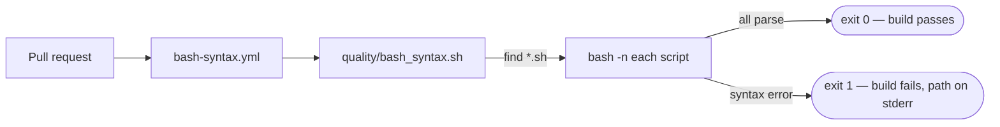

# PR Summary — Missing CI `bash -n` syntax gate (#479)

## Summary

The repository ships bash scripts (`quality.sh`, `helpers/server.sh`) but had no
CI step that runs `bash -n` over them. Bash has no compile step, so a syntax
error can land on the default branch unnoticed. This PR adds a committed gate
script and a dedicated CI workflow that fails the build the moment an
unparseable script appears. **Closes #479.**

The existing ShellCheck gate (`.github/workflows/shellcheck.yml`) already covers
the linting half of the audit finding; this change adds the missing parse-only
`bash -n` gate.

- **`quality/bash_syntax.sh`** — a committed gate that discovers every `*.sh`
  file (pruning `node_modules`, `.git`, `vendor`) and runs `bash -n` over each
  one. It **fails loud** (Issue #3234): a syntax error or a missing scan root
  exits non-zero with the offending path on stderr; success is only reported
  when every script parses. The repo commits and owns its own gate — no shared
  cross-repo Action (repo-isolation, Issue #3239).
- **`.github/workflows/bash-syntax.yml`** — invokes the gate on every pull
  request. Obeys the repo-wide workflow policies: SHA-pinned checkout, job
  `timeout-minutes`, cancelling concurrency group, and
  `persist-credentials:
  false`.
- **`quality.sh`** — runs the same gate locally for CI parity.
- **`README.md`** — documents the new gate alongside the other CI gates.

## Evidence

Backend/CLI change — no web interface to screenshot. Verified via TDD tests plus
direct execution of the committed gate:

```text
==> bash -n syntax gate over: /…/NEAT-AI-Explore
  ok   /…/quality/bash_syntax.sh
  ok   /…/quality.sh
  ok   /…/helpers/server.sh
==> bash syntax gate passed (3 script(s))
```

Full `./quality.sh` run: **789 passed | 0 failed**. The gate script itself
passes both `bash -n` and `shellcheck --severity=warning`.



## Test Plan

- `tests/bash_syntax_gate_test.ts` — exercises the real committed script
  end-to-end against temporary trees:
  - passes for valid scripts (exit 0)
  - fails on a syntax error and names the offending file on stderr
  - ignores non-shell files
  - tolerates a tree with no scripts
  - errors on a missing scan root
  - passes over the repository's own committed scripts
- `tests/workflow_bash_syntax_gate_test.ts` — asserts `bash-syntax.yml` invokes
  the gate, triggers on `pull_request`, caps its job timeout, declares a
  cancelling concurrency group, and does not persist the GITHUB_TOKEN.

Both suites were confirmed red before the gate/workflow existed and green after.
