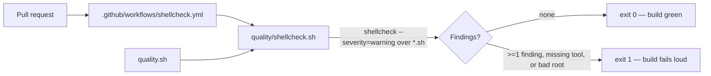

## Summary

Added a committed ShellCheck gate so common bash mistakes — unquoted expansions,
undefined variables — can no longer land on the default branch. The repository
already ran `bash -n` (#479) and linted `run:` blocks via actionlint, but had no
single-source-of-truth, locally-runnable `shellcheck` gate over its `*.sh`
files. This change follows the exact pattern established by the bash syntax gate
(#479): a committed `quality/*.sh` script that CI invokes and that `quality.sh`
runs locally for parity. Closes #480.

Each repository commits and owns its own gate — there is no shared cross-repo
Action.

Changes:

- **`quality/shellcheck.sh`** — new committed gate. Discovers every `*.sh` file
  under a scan root (pruning `node_modules`/`.git`/`vendor`, null-delimited for
  path safety), runs `shellcheck` over the set, and fails loud (exit 1) on any
  finding at or above the configured severity (`warning` by default, override
  with `SHELLCHECK_SEVERITY`). Fails loud rather than passing silently when
  `shellcheck` itself is missing or the scan root does not exist (#3234).
- **`.github/workflows/shellcheck.yml`** — now invokes `./quality/shellcheck.sh`
  instead of the third-party `ludeeus/action-shellcheck`, so the shellcheck
  configuration is one source of truth shared by CI and local runs. The
  PR-trigger, 5-minute timeout, cancelling concurrency group, and
  `persist-credentials: false` checkout are unchanged.
- **`quality.sh`** — runs the shellcheck gate locally after the bash syntax
  gate; skips gracefully with a notice when `shellcheck` is not installed
  locally (CI still enforces it).
- **`README.md`** — documents the new ShellCheck gate alongside the bash syntax
  gate.
- **`docs/archive/pr-summaries/pr-summary-479.md`** — applied a pending
  `deno fmt` reflow so the repo-wide format check passes cleanly (mechanical, no
  content change).

## Evidence

Backend/CLI change — no web interface to screenshot. Verified by running the new
gate against the repo's own scripts and the full quality gate locally.



Local run of the gate over the repo's own scripts:

```
==> shellcheck gate (severity: warning) over: .../NEAT-AI-Explore
==> shellcheck gate passed (4 script(s))
```

`./quality.sh` passes: `ok | 799 passed | 0 failed`.

## Test Plan

- Added `tests/shellcheck_gate_test.ts` — behaviour tests that build temporary
  script trees and run the real gate end-to-end: passes on a clean script, fails
  (non-zero, names the offending file) on an `SC2154` finding, ignores non-shell
  files, tolerates a tree with no scripts, errors on a missing scan root, and
  passes over the repository's own scripts. Lint cases are skipped when
  `shellcheck` is unavailable.
- Added `tests/workflow_shellcheck_gate_test.ts` — asserts `shellcheck.yml`
  invokes the gate (or `shellcheck`), triggers on `pull_request`, caps its job
  timeout, and declares a cancelling concurrency group.
- Existing `tests/workflow_shellcheck_persist_credentials_test.ts` continues to
  pass (checkout still sets `persist-credentials: false`).
