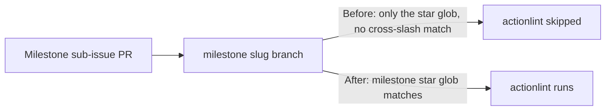

## Summary

The actionlint CI quality workflow gated only single-segment branches. Its
`pull_request.branches` filter was `["*"]`, and GitHub's `*` glob does not cross
a `/`, so it matched `Develop`/`main` but never a `milestone/<slug>` branch.
Milestone sub-issue PRs target a shared `milestone/<name>` branch, so the
actionlint gate was silently skipped on every one of them — workflow
regressions merged into the milestone branch unchecked, only caught later by the
single rollup PR into the default branch.

Fixed by adding the `milestone/*` glob to the filter
(`branches: ["*", "milestone/*"]`) so the gate also runs on milestone PRs.
Milestone branch names are `milestone/<slug>` with no nested slashes, so the
single-level `milestone/*` glob is sufficient. Closes #492.

## Evidence

Backend/CI change only — no web interface to screenshot. Verified via new unit
tests that model GitHub's branch-filter glob semantics (`*` does not cross `/`).

## Test Plan

Added `tests/workflow_actionlint_milestone_branch_test.ts`:

- `actionlint.yml gates milestone/<slug> PRs (#492)` — reproduces the bug: fails
  against the old `["*"]` filter, passes after adding `milestone/*`. Uses a
  glob-matcher that mimics GitHub's rule that `*` does not cross `/`.
- `actionlint.yml still gates default-branch PRs (#492)` — guards against a
  regression that would drop coverage of the `Develop` branch.

Full `./quality.sh` gate passes (801 tests).
