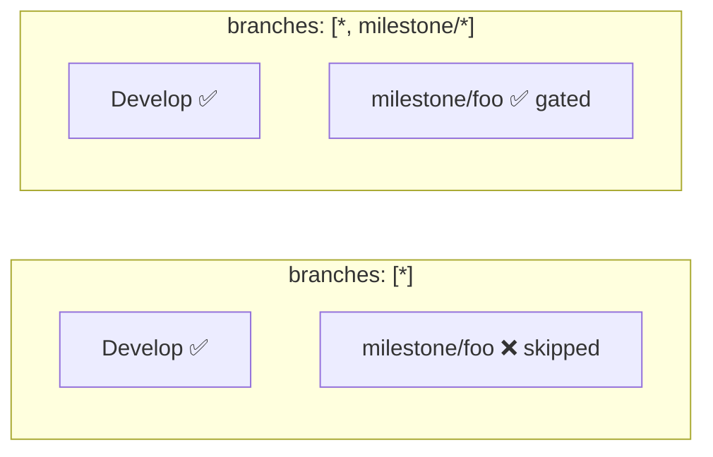

# PR Summary — Issue #492

## Summary

The actionlint CI quality workflow declared `pull_request.branches: ["*"]`.
GitHub Actions treats `*` as "any character **except** `/`", so the filter
never matched a `milestone/<slug>` branch. Milestone sub-issue PRs target a
shared `milestone/<name>` branch, so the actionlint gate was silently skipped
on every intermediate sub-issue PR — the workflow regressions it guards against
could land in the milestone branch unchecked, caught only later by the single
rollup PR into the default branch.

Fixed by adding the single-level `milestone/*` glob to the workflow's
`pull_request.branches` filter (`["*", "milestone/*"]`). This preserves the
existing coverage of all ordinary single-level branches and additionally runs
the gate on milestone PRs. Milestone branch names are `milestone/<slug>` with
no nested slashes, so the single-level `milestone/*` glob is sufficient.

Closes #492.

## Evidence

Backend/CI-config change — no web interface to screenshot. Verified via the new
Deno tests, which replicate GitHub's branch-filter glob semantics and assert the
configured filter matches representative milestone branches while still matching
ordinary branches.

Branch-filter matching before vs after:



Test run after the fix:

```
running 2 tests from ./tests/workflow_actionlint_milestone_branch_test.ts
actionlint.yml runs on milestone/<slug> PRs (#492) ... ok
actionlint.yml still runs on ordinary single-level branches (#492) ... ok
ok | 2 passed | 0 failed
```

Full `./quality.sh` gate: `ok | 801 passed | 0 failed`.

## Test Plan

- Added `tests/workflow_actionlint_milestone_branch_test.ts`:
  - `actionlint.yml runs on milestone/<slug> PRs (#492)` — reproduces the bug
    (fails against the pre-fix `["*"]` filter) by asserting the filter matches
    `milestone/foo` and `milestone/issue-492-fix`.
  - `actionlint.yml still runs on ordinary single-level branches (#492)` —
    guards against regression by asserting `Develop`, `main`, and `feature-x`
    still match.
- The test implements GitHub's branch-filter glob semantics (`*` stops at `/`,
  `**` crosses `/`, `?` matches one non-`/` char) so it asserts real matching
  behaviour rather than string equality.
