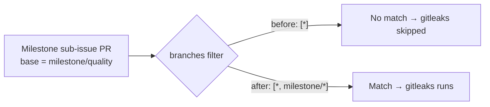

## Summary

The Gitleaks secret-scan CI workflow (`.github/workflows/gitleaks.yml`) used a
`pull_request.branches: ["*"]` filter. GitHub Actions treats `*` as "any
character except `/`", so the glob never matched a `milestone/<slug>` branch —
milestone sub-issue PRs merged into the shared milestone branch without the
secret scan running. Added the `milestone/*` glob so the gate also runs on
milestone PRs, mirroring the fixes already applied to `actionlint.yml` (#492)
and `deno-quality.yml` (#493). Closes #494.

## Evidence

Backend/CI-only change — no web interface to screenshot. Verified via TDD:

- Before the fix, `workflow_gitleaks_milestone_branch_test.ts` failed for
  `milestone/foo` (`Got branches=["*"]`).
- After changing `branches` to `["*", "milestone/*"]`, both new tests pass and
  the full suite is green (`805 passed | 0 failed`).

The branch-glob semantics are replicated in the test (`*` stops at `/`, `**`
crosses `/`), matching GitHub's documented behaviour.

## Test Plan

- Added `tests/workflow_gitleaks_milestone_branch_test.ts`:
  - `gitleaks.yml runs on milestone/<slug> PRs (#494)` — asserts the filter
    matches `milestone/foo` and `milestone/issue-494-fix`.
  - `gitleaks.yml still runs on ordinary single-level branches (#494)` —
    regression guard for `Develop`, `main`, `feature-x`.
- Ran `./quality.sh` — all 805 tests pass.
