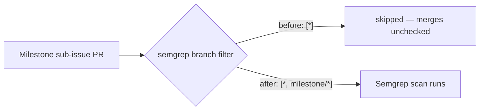

## Summary

The Semgrep CI quality workflow (`.github/workflows/semgrep.yml`) filtered
`pull_request.branches` to `["*"]`. GitHub Actions treats `*` as "any character
except `/`", so that glob never matched a `milestone/<slug>` branch. Milestone
sub-issue PRs target a shared `milestone/<name>` branch, so the Semgrep scan was
silently skipped on every intermediate sub-issue PR — the gap was only caught
later by the single rollup PR into the default branch.

Added `milestone/*` to the branch filter (`branches: ["*", "milestone/*"]`) so
the gate runs on milestone PRs while still matching ordinary single-level
branches. This mirrors the existing fix already applied to `gitleaks.yml`,
`actionlint.yml`, `deno-quality.yml`, and `markdown-lint.yml`.

Closes #496.

## Evidence

Backend/CI change — no web interface to screenshot. Verified via new unit tests
that replicate GitHub's branch-filter glob semantics and via the full quality
gate (`./quality.sh`): **809 passed | 0 failed**.

## Test Plan

- Added `tests/workflow_semgrep_milestone_branch_test.ts`:
  - `semgrep.yml runs on milestone/<slug> PRs (#496)` — reproduces the bug
    (failed against the old `["*"]` filter, passes after the fix).
  - `semgrep.yml still runs on ordinary single-level branches (#496)` — guards
    against regressing existing coverage (Develop, main, feature-x).
- All 809 existing tests continue to pass.
