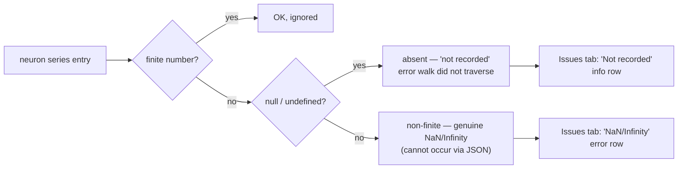

# Issues tab: absent (`null`) value entries are no longer flagged as NaN/Infinity

## Summary

The Issues tab wrongly reported absent (`null`) `value`/`errors`/`activation`
entries as "NaN/Infinity (exploding gradients)". Recordings are serialised
through JSON, which **cannot** carry non-finite numbers — a genuinely non-finite
value always serialises to `null`. So a `null` in a neuron series means the
value was **not recorded** (the error-attribution walk did not traverse that
neuron on that observation), not that a non-finite number was produced. Every
flagged cell in the reported snapshot was one of these structural `null`s.

This change teaches the diagnostics scan to distinguish the two cases and
presents the raw fact instead of a false alarm. Genuine non-finite numbers
(should they ever arrive from a non-JSON source) are still surfaced separately.

**Fixes #507.**

### What changed

- **`docs/shared/diagnostics_scan.js`**
  - `scan1d` / `scan2d` now return `absentCount` / `firstAbsentPos` alongside
    the existing non-finite `count` / `firstPos`. `null`/`undefined` count as
    _absent_; only real `NaN`/`Infinity` numbers (and unexpected non-numeric
    junk) count as _non-finite_.
  - `computeNonFiniteIssues` now reports a per-neuron `total` (genuine
    non-finite) **and** `absentTotal` (not recorded), with per-series counts,
    first-observation references, and series lengths. A neuron is included when
    it has any non-finite **or** any absent entry.
- **`docs/app.js` (Issues tab)**
  - Removed the always-shown, structurally-false "NaN/Infinity (exploding
    gradients)" row.
  - Added a genuine "NaN/Infinity (non-finite numbers)" row, shown **only** when
    real non-finite numbers exist.
  - Added a raw-fact "Not recorded" info row, e.g.
    `value not recorded for k/N
    observations (error walk did not traverse)`
    — no interpretation, no severity editorialising.
  - Added a "Not recorded (top 10)" flagged list; the "NaN/Infinity (top 10)"
    list now filters to genuine non-finite neurons only.

### Data-flow

## Evidence

Both panels below render the **same** synthetic recording
(`value = [0.5, null, null, 0.6, null]` plus one genuinely `NaN` errors cell)
through the real `computeNonFiniteIssues()`. Before, three JSON `null`s were
mislabelled as exploding gradients; after, they are reported as "not recorded"
and only the genuine `NaN` remains flagged.

This is a viewer/data-logic change. The Issues tab needs an externally-loaded
snapshot, so the screenshot was produced from a self-contained harness that
imports the production `docs/shared/diagnostics_scan.js` module (the harness was
removed after capture; only the PNG is committed).

## Test Plan

All 827 repo tests pass (`deno test -A`). New/updated coverage in
`tests/diagnostics_scan_test.ts`:

- `scan1d separates non-numeric junk from absent (null) entries` — **updated**
  business-logic test (previously asserted `null` counted as non-finite; now
  asserts the corrected absent/non-finite split, documented inline).
- `scan1d counts null/undefined as absent, not non-finite`
- `scan1d keeps NaN/Infinity as non-finite (not absent)`
- `scan2d counts null cells as absent, not non-finite`
- `scan2d separates absent cells from genuine NaN cells`
- `computeNonFiniteIssues reports null value entries as absent, not non-finite`
  — regression test for the reported bug.
- `computeNonFiniteIssues maps first absent through obsIndices`
- `computeNonFiniteIssues separates non-finite total from absent total`
- `computeNonFiniteIssues keeps skipping entirely clean neurons`

## Related (out of scope, already reported per the issue)

- `stSoftwareAU/NEAT-AI-Discovery#1620` — 15 functionally-constant hidden
  neurons that persist because removal is gain-driven.
- `stSoftwareAU/NEAT-AI#3389` — producer-side recording gap for aggregate-squash
  neurons (complements, does not block, this viewer fix).
