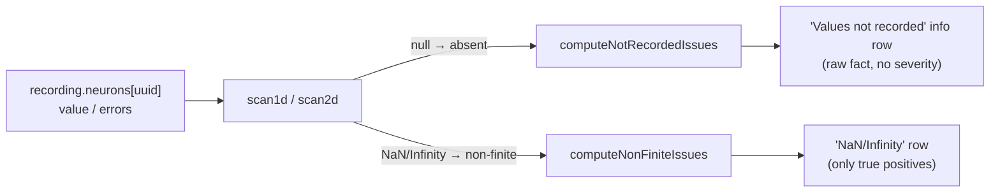

## Summary

The Issues tab wrongly reported absent (`null`) recording entries as
"NaN/Infinity (exploding gradients)". A recording serialises through JSON, which
cannot carry `NaN`/`Infinity` — those land as `null`, meaning the value was
**not recorded** (the error-attribution walk did not traverse that neuron at
that observation), not that a gradient exploded. The scan counted every `null`
as non-finite, so ~39k not-recorded cells were mis-flagged as data corruption.

The fix is viewer-only: `scan1d`/`scan2d` now classify each anomaly as either
**absent** (`null`/`undefined`) or **genuine non-finite** (`NaN`/`Infinity`).
`computeNonFiniteIssues` counts only genuine non-finite values (so a real
anomaly still surfaces loudly — fail-loud, Issue #3234), and a new
`computeNotRecordedIssues` reports the absent counts. The Issues panel keeps the
NaN/Infinity row for true positives and adds a factual **"Values not recorded"**
info row (e.g.
`value not recorded for 4/4 observations (error walk did not
traverse)`) with no
severity styling or interpretation.

Closes #507.

## Data flow

## Evidence

Captured live via a headless Chrome render of the real viewer, loading a
minimal snapshot whose `output-0` neuron activates on every observation but
records `null` for 7 of 10 `value` slots (the exact shape described in the
issue). The Issues tab now shows the "NaN/Infinity (exploding gradients)" row
as **"No NaN/Infinity values detected"** and adds the factual **"Values not
recorded"** info row — no false exploding-gradient flag:

Before the fix, the same input yielded a non-empty `computeNonFiniteIssues`
result and rendered the false "NaN/Infinity (exploding gradients)" error row.

## Test Plan

Added to `tests/diagnostics_scan_test.ts`:

- `scan1d classifies null/undefined as absent, not non-finite`
- `scan1d separates absent nulls from genuine non-finite`
- `scan2d separates absent nulls from genuine non-finite`
- `computeNonFiniteIssues ignores absent (null) value entries` — reproduces the
  #507 bug (all-null neuron must not be flagged) and passes after the fix.
- `computeNonFiniteIssues still flags genuine NaN alongside nulls`
- `computeNotRecordedIssues counts absent value entries with denominator`
- `computeNotRecordedIssues ignores genuine non-finite values`
- `computeNotRecordedIssues maps first absent index via obsIndices`
- `computeNotRecordedIssues counts absent 2D error rows`
- `computeNotRecordedIssues returns empty map for clean data`
- `computeNotRecordedIssues returns empty map for null recording`

All existing `scan1d`/`scan2d`/`computeNonFiniteIssues` tests still pass
unchanged (they exercise genuine `NaN`/`Infinity` inputs, which remain flagged).
Full gate: `./quality.sh` → 830 passed, 0 failed.
