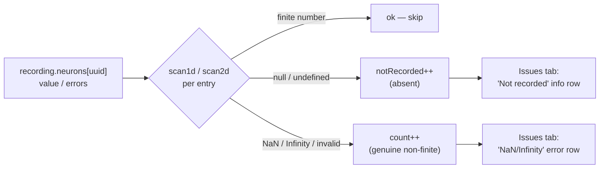

# PR Summary — Issue #507

## Summary

The Issues tab wrongly reported absent (`null`) recording entries as
"NaN/Infinity (exploding gradients)". JSON cannot serialise non-finite numbers,
so every flagged cell was actually a JSON `null` — the value was simply **not
recorded** for that observation (the error-attribution walk did not traverse
that neuron). Nothing was genuinely non-finite and nothing was skipped.

The scanner (`docs/shared/diagnostics_scan.js`) conflated "absent" with
"non-finite" because `null` fails the `typeof v === "number"` check and was
counted as an offending value. This fix separates the two facts and presents the
recording gap verbatim, with no interpretation:

- `scan1d` / `scan2d` now return `count`/`firstPos` for **genuine** non-finite
  numbers (NaN/Infinity or otherwise invalid non-null values) and
  `notRecorded`/`firstNotRecordedPos` for **absent** (`null`/`undefined`)
  entries.
- `computeNonFiniteIssues` carries per-series `notRecorded`/`n` and a
  `notRecordedTotal`; a neuron is emitted when it has any non-finite number
  **or** any absent entry.
- The viewer (`docs/app.js`) drops the false "NaN/Infinity (exploding
  gradients)" row for null-only neurons and instead shows a raw-fact **"Not
  recorded"** info row —
  `value not recorded for k/N observations (error walk did not traverse)`. The
  global "NaN/Infinity (top 10)" list now excludes not-recorded-only neurons
  (`total === 0`).

Fixes #507.

## Data flow

## Evidence

Issues tab for `output-0` (all four recorded `value`s are `null`): the panel now
shows a factual **"Not recorded — value not recorded for 4/4 observations (error
walk did not traverse)"** row and **no** false NaN/Infinity error flag. Captured
via Playwright against a locally-served `docs/` build with a synthetic snapshot
whose `value` series is all `null`.

## Test Plan

Unit tests in `tests/diagnostics_scan_test.ts` (all 31 pass; full `./quality.sh`
green — 824 tests):

- `scan1d treats null entries as not recorded, not non-finite (issue #507)` —
  null entries counted as `notRecorded`, not `count`.
- `scan2d treats null cells as not recorded, not non-finite (issue #507)` — 2D
  variant.
- `scan1d counts invalid non-null values as non-finite, nulls as not recorded`
  (updated from the prior test that asserted `null` was non-finite — the old
  assertion encoded the bug) — a string stays non-finite, a `null` becomes
  not-recorded.
- `computeNonFiniteIssues reports null value entries as not recorded, not
  non-finite`
  — `total === 0`, `notRecordedTotal === 1`, `value.n === 3`.
- `computeNonFiniteIssues separates non-finite numbers from not-recorded nulls`
  — mixed NaN/Infinity + nulls counted into the correct buckets.
- `computeNonFiniteIssues emits a neuron with only not-recorded entries` — a
  null-only neuron is still surfaced (gap not hidden).

### Deno regression avoided

Screenshot evidence was captured with a throwaway Playwright install under
`/tmp` — no `package.json`, `node_modules`, or other Node tooling was added to
this Deno repo.

## Scope note

Viewer-only fix, per the issue's accepted scope. No producer-side NaN sentinel
was added — the snapshot pipeline serialises through JSON, so upstream
finiteness is trusted. The two cross-repo reports referenced in the issue
(NEAT-AI-Discovery#1620, NEAT-AI#3389) are separate and not blocked by this
change.
