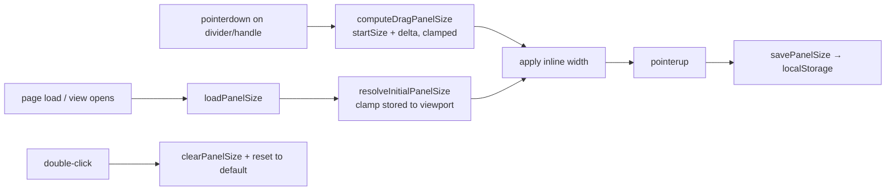

## Summary

Made the explorer's panels resizable with the chosen sizes remembered across
sessions. **Closes #510.**

- **Main explorer split** — the `.flowArrow` divider between the neuron-detail
  panel (`.currentNeuron`) and the inbound-synapse list (`.synapseList`) is now
  a draggable vertical separator on desktop (≥1024px). Dragging rebalances the
  split; the left panel's width is saved and restored.
- **Graph overlays** — the 3D graph view's Focus (`#hud`) and Legend (`#legend`)
  overlays each gain a width-resize handle on their free edge (Focus grows
  right, Legend grows left). Their existing Minimise/Expand collapse toggles are
  unchanged.
- **Persistence** — each size is stored under its own `localStorage` key and
  restored on load, **clamped to the current viewport** so a size saved on a
  larger window is not applied verbatim after the window shrinks.
- **Reset** — double-click / double-tap on a divider or handle resets that
  boundary to its default and clears the stored value.
- **Bounds** — sensible min/max keep any panel from being dragged unusable.
- **Input** — works with both mouse and touch via the Pointer Events API
  (`touch-action: none` so a touch drag resizes rather than scrolls); arrow keys
  also nudge a focused separator for keyboard users.

Out of scope per the issue's Round 1 answers, left unchanged: the tablet
slide-in Synapses panel, the phone stacked explorer layout (≤639px), and the
graph view's phone bottom-sheet HUD (≤640px handles are hidden and the
stylesheet keeps ownership of those layouts).

### Design

The size maths and persistence live in a pure, DOM-free module
(`docs/shared/panel_resize.js`) following the existing injectable-`storage`
pattern from `observation_contributions_storage.js`, so they are fully
unit-testable in Deno. The browser-only drag wiring lives in `app.js` (explorer)
and `graph/graph.js` (overlays). The graph overlay handles are wired
independently of the WebGL renderer so the panels stay resizable even if the 3D
canvas cannot start.

## Evidence

Screenshots captured against a small local snapshot (headless Chromium via CDP).

**Explorer split — default 320px (left panel content clipped, e.g. `output`
wraps to `outp ut`, `LOGISTIC` stacks vertically):**

**Explorer split — restored wider 520px (content no longer clipped):**

**Graph overlays — default widths (Focus 420, Legend 320):**

**Graph overlays — restored from localStorage (Focus widened to 380, Legend
narrowed to 250 so its text wraps):**

> Note: the "Starfield failed to start: WebGL not supported" banner in the graph
> screenshots is a headless-Chromium limitation (no WebGL), not related to this
> change. The overlay panels and their resize handles are DOM and render/behave
> normally; a real browser shows the 3D canvas behind them.

## Test Plan

Added `tests/panel_resize_test.ts` (17 tests) exercising the pure module by
calling real functions and asserting results:

- `parsePanelSize` — accepts positive numbers/strings; rejects missing, corrupt,
  zero and negative values.
- `clampPanelSize` — keeps in-range values, clamps to bounds, fits the viewport
  when `max < min`, and returns `null` for non-finite inputs.
- `resolveInitialPanelSize` — restores a valid stored value, clamps a stored
  value that no longer fits, and falls back to the (clamped) default.
- `computeDragPanelSize` — adds the signed delta and clamps; null on non-finite.
- `loadPanelSize` / `savePanelSize` / `clearPanelSize` — round-trip via an
  in-memory `StorageLike`, reject non-positive sizes, stay defensive when
  storage throws (privacy mode) or is unavailable.

Full gate passes: `deno fmt --check`, `deno lint`, `deno check`, and
`deno test -A` (855 tests, 0 failures). The service-worker static-file test
(`sw_static_files_test.ts`) confirms the new shared module is cached.
