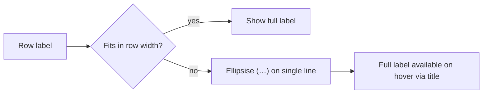

# Observation Contributions labels use the available row width (Issue #512)

## Summary

The viewer's "Observation Contributions" panel — and the two other panels
sharing the `.impactBreakdownOut` row style (Downstream terms and Inbound
synapse allocation) — clipped every row label with an ellipsis at a fixed
`max-width: 140px`, even when a wide empty gap sat before the percentage badge
(e.g. `volume-recommen…`). Row labels now flex into the available row width and
ellipsise **only** on genuine overflow. Closes #512.

Changes:

- **`docs/styles.css`** — replaced the fixed `max-width: 140px` on
  `.impactBreakdownOut` with `flex: 1 1 auto` + `min-width: 0`, so the label
  grows into the row and `text-overflow: ellipsis` engages only when the label
  truly does not fit. `.observationContributionsLabelWrap` now grows into the
  row so the wrapped label can use the space. Single-line clipping is retained
  (`white-space: nowrap`) so narrow viewports still clip rather than wrap.
- **`docs/app.js`** — dropped the 20-character hard truncation in
  `truncateNeuronName()` so CSS overflow handling is the single truncation
  mechanism. Added `fullNeuronName()` and set the full, untruncated label as a
  `title` attribute on the Downstream terms and Inbound synapse rows so any
  still-clipped label is readable on hover.
- **`docs/shared/observation_contributions.js`** — set the full label as an
  (HTML-escaped) `title` attribute on each Observation Contributions row label.

## Evidence

Rendered via the real `styles.css` and the real
`buildObservationContributionsHtml()` output. `volume-recommendation (input-0)`
now renders in full where it previously clipped to `volume-recommen…`; only the
genuinely-too-long last label ellipsises, and its full text is available on
hover.

## Test Plan

Added to `tests/observation_contributions_panel_test.ts`:

- `buildObservationContributionsRow: no fixed-width clip on the label div` —
  asserts the full `alias (uuid)` label renders untruncated and no JS-side
  ellipsis is injected.
- `buildObservationContributionsRow: sets full label as the title attribute` —
  asserts the row label carries the full label as a `title` for hover.
- `buildObservationContributionsRow: escapes the title attribute` — asserts the
  `title` value is HTML-escaped to prevent attribute injection.

All 858 tests pass and `./quality.sh` is clean.
