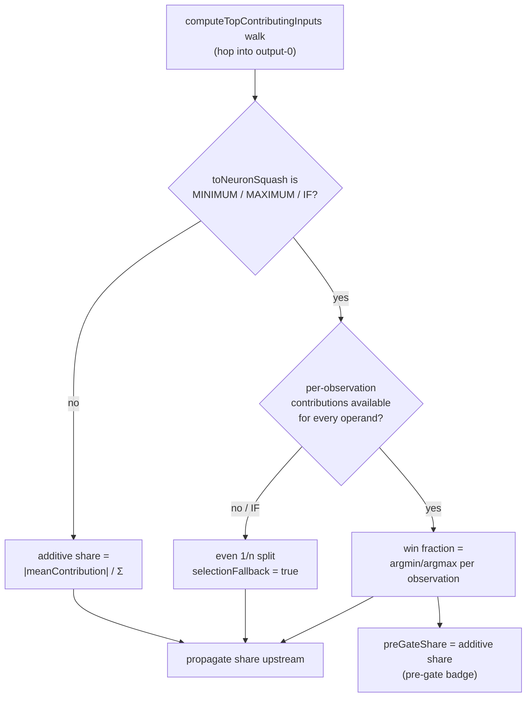

## Summary

The Trace Explorer's **Observation contributions** panel misattributed a
`MINIMUM`-squash output to its large-magnitude operand. In the reported case
`output-0 = min(priceRecommend, volumeRecommend)` showed the **volume** branch
at ~99%, even though for liquid stocks the volume branch almost never binds the
min. The attribution walk allocated each inbound synapse's share **additively**
by `|meanContribution|` (fallback `|weight|`) with no `MINIMUM`/`MAXIMUM`/`IF`
awareness — so a rarely-winning but large-magnitude operand was credited nearly
all of the output's influence.

This is a **viewer-only** fix (the engine and Discovery already attribute
correctly). At a selection-squash neuron each inbound synapse's share is now
allocated by its **win fraction** — the fraction of recorded observations where
its `weight·activation` is the argmin (`MINIMUM`) / argmax (`MAXIMUM`) —
mirroring NEAT-AI-Discovery's `compute_min_stats` / `compute_max_stats`. `IF`
and any selection neuron whose operands lack per-observation records fall back
to an even `1/n` split (flagged via `selectionFallback`). The additive share is
preserved as `preGateShare` so the existing pre-gate badge still shows the old
value for comparison.

Closes #513.

## Change flow

## Evidence

Playwright MCP was not available in this environment, so visual capture was not
possible. Instead the fix was verified **end-to-end** by driving the real
`computeTopContributingInputs` walk (the exact module the panel uses) against a
minimal snapshot reproducing the issue —
`output-0 = MINIMUM(priceRecommend,
volumeRecommend)`, where `price` binds the
min on 9 of 10 observations and the larger-magnitude `volume` binds it on 1:

| Operand         | Before (additive) | After (win fraction) |
| --------------- | ----------------- | -------------------- |
| volumeRecommend | **88.9%**         | 10.0%                |
| priceRecommend  | 11.1%             | **90.0%**            |

The panel now credits the operand that actually binds the min, matching the
real-world expectation stated in the issue (volume is usually ignored because
stocks are liquid).

## Test Plan

- `tests/selection_attribution_test.ts` — unit tests for the new pure module
  `docs/shared/selection_attribution.js`: MINIMUM/MAXIMUM win fractions, tie
  splitting, non-finite handling, ragged series, and the even-split / IF
  fallbacks.
- `tests/selection_squash_allocation_test.ts` — integration tests for
  `computeInboundSynapseImpactAllocation` and the `computeTopContributingInputs`
  walk, including a regression reproducing the issue scenario (`volume` no
  longer dominates a `MINIMUM` output) and a guard that non-selection squashes
  keep the additive share unchanged.
- `tests/lint_coverage_test.ts` — extended to lint-cover the new shared module.
- Full `./quality.sh` passes (877 tests, fmt + lint + type-check clean).
