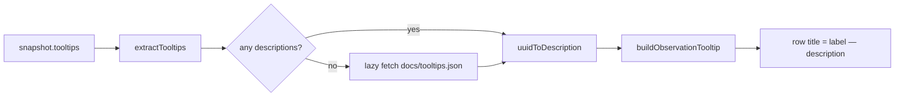

## Summary

Hovering an observation now shows that input's human-readable summary from
`Tooltips.json`, in every view. Previously the hover title just repeated the
row's own label. Closes #521.

- **New shared helper** `buildObservationTooltip()` in
  `docs/shared/ui_helpers.js` builds `"label — description"`, falling back to
  the label alone (prior behaviour) when no description exists.
- **Surfaces wired**: the Observation Contributions panel rows (new
  `getDescription` lookup), the Observations dashboard rows, and the
  impact/inbound breakdown rows via `fullNeuronName()`. The trace breadcrumb,
  neuron card, synapse rows and the graph explorer's labels/focus badge/HUD
  already surfaced the description and are unchanged.
- **Snapshot tooltips stay the source of truth** so the viewer still works for
  non-GRQ networks. Snapshots generated before GRQ embedded `Tooltips.json`
  carry no descriptions; for those the new `docs/shared/tooltips_fallback.js`
  lazily fetches the bundled copy at `docs/tooltips.json` and merges it _under_
  anything the snapshot supplied.
- **Fail loud**: a missing or malformed bundle throws with the HTTP status
  rather than resolving to an empty map, and the call sites log the fault via
  `console.error` instead of silently degrading to label-only tooltips. A failed
  load is not cached, so a transient error is retryable.
- The ~430 KB bundle is deliberately **not** precached by the service worker —
  only the small module is — so a snapshot with its own tooltips never downloads
  it.



## Evidence

Captured with `docs/evidence/_issue_521_shot.ts` (Astral/Chromium) against the
real default snapshot. Native `title` tooltips are OS-drawn and never appear in
a screenshot, so the script reads the row's actual `title` attribute and renders
it as a bubble — the bubble text is exactly what a mouse-over shows.

**Observation Contributions panel** — the highlighted row's hover text carries
the observation's summary:


**Observations dashboard** — same behaviour on the dashboard rows:


Row `title` attributes read from the live page:

```text
observation row titles:
  "WUIGLOBALSMPAVG mean 8Q (input-1403) — Global: Simple Average: 8-quarter mean"
  "volume-recommend (input-183) — Liquidity recommendation based on average daily trading volume relative to position size"
  "WLEMUINDXD change 28D (input-1418) — Equity Market-related Economic Uncertainty Index: 28-day change"

observations modal row titles:
  "divYieldYr-0 (input-0) — Dividend yield for the current year"
  "divYieldYr-1 (input-1) — Dividend yield for 1 year ago"
```

## Test Plan

`./quality.sh` passes: fmt, lint, type check, **898 tests, 0 failed**.

Added:

- `tests/ui_helpers_test.ts` — six `buildObservationTooltip` cases: description
  appended, label-only fallback (missing and whitespace-only description), uuid
  fallback when unlabelled, description-only, empty input, whitespace trimming.
- `tests/observation_contributions_panel_test.ts` — four cases: the row title
  carries the description, keeps the label-only title when there is none,
  HTML-escapes the description inside the `title` attribute, and
  `buildObservationContributionsHtml` threads `getDescription` to every row.
- `tests/tooltips_fallback_test.ts` — `needsFallbackTooltips` (empty vs
  populated), `mergeTooltipMaps` (snapshot wins; missing maps), URL resolution,
  and `loadFallbackTooltips` happy path, single-fetch caching, loud failure on
  HTTP 404, no caching of a failed fetch, and rejection of a malformed payload.
  Also asserts the committed `docs/tooltips.json` parses and carries observation
  descriptions.

Existing `buildObservationContributionsRow` title tests were left untouched and
still pass — omitting `getDescription` preserves the label-only tooltip.

## Security Self-Check

- **Input validation**: `buildObservationTooltip` and `extractTooltips` coerce
  and trim, ignoring non-string values; `loadFallbackTooltips` rejects any
  payload that is not a uuid-keyed object.
- **Output encoding**: every tooltip string is passed through `escapeHtml`
  before it reaches a `title` attribute (covered by a dedicated escaping test).
- **Secrets / dependencies**: no new dependency; the only new data file is a
  copy of GRQ's public `src/v/Tooltips.json` (input names and descriptions,
  approved for this public repo in the issue).
- **Error handling**: failures surface as `console.error` with the HTTP status
  and URL; no stack traces or internal state reach the UI.
