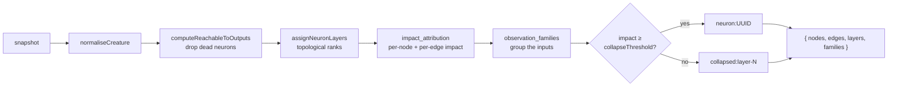

## Summary

Adds the shared, DOM-free data foundation every candidate replacement graph view
will consume: an **aggregated, layered graph model** derived client-side from a
loaded snapshot. At the default published snapshot scale (2,461 inputs, 1,655
hidden, 1 output, 21,492 synapses) the raw graph is unreadable, so the model
aggregates before any view renders it. Closes #524.

Two new modules, no UI:

- `docs/shared/observation_families.js` — buckets the 2,461 inputs into
  observation families. The key comes from the tooltip `group` already surfaced
  by `extractTooltips`, falling back to the label's leading segment, then to
  `ungrouped`. Callers can pass their own `deriveFamily` for a per-stock
  bucketing.
- `docs/shared/aggregated_graph_model.js` — returns
  `{ nodes, edges, layers, families, meta }`:
  - **reachability** — `buildGraphIndex` + `computeReachableToOutputs` drop
    neurons that cannot influence any output;
  - **layers** — `assignNeuronLayers` ranks neurons with a longest-path Kahn
    sweep, terminates on recurrent graphs, and pins outputs to the final layer;
  - **impact** — `computeInboundSynapseImpactAllocation` gives per-edge shares;
    exported `derived.impactsByNeuronUuid` values win for nodes, and anything
    missing (inputs, typically) is propagated back from the outputs.
    `computeImpactBreakdownToOutputs` then attaches per-node output shares over
    the aggregated graph;
  - **collapse** — `collapseThreshold` (default 1% of the strongest neuron)
    folds weak neurons into a per-layer aggregate. Outputs are never collapsed.

Every aggregate node keeps its `members` (underlying neuron UUIDs) and a stable
`id`, so a later per-stock or stock-comparison view can re-expand or re-weight
an aggregate without a rewrite. Output is deterministic — nodes, edges, layers
and families are all sorted — so a view can memoise on a serialised model.

Two deliberate fail-loud / no-silent-cap decisions:

- a snapshot with no creature throws rather than returning an empty model;
- per-node output attribution is skipped above `maxAttributionNodes` (default
  400) and `meta.outputSharesComputed` reports `false`, rather than quietly
  returning empty shares.

## Evidence

Backend/data change only — there is no web interface to screenshot in this issue
(views are separate sub-issues of #522). Verified by the new unit suites and the
full quality gate: `./quality.sh` passes with **924 tests, 0 failures**
(`deno fmt --check`, `deno lint`, repo-wide `deno check`, `deno test -A`, plus
the bash-syntax and shellcheck gates).

## Test Plan

New `Deno.test` suites, all "what" tests — they import the modules, call the
real functions against a fixture snapshot and assert on the returned model.

`tests/aggregated_graph_model_test.ts` (18 cases):

- returns `{ nodes, edges, layers, families }` with the default threshold in
  `meta`;
- inputs collapse into one family node per family at layer 0, members retained;
- layers are topological, outputs sit on the final layer, and every aggregate
  edge advances a layer;
- `assignNeuronLayers` ranks a chain (a short-circuit edge does not drag the
  output back) and terminates on a recurrent graph;
- neurons that cannot reach an output are dropped and counted in `meta`;
- per-node impact aggregates member impacts (exported values verbatim,
  propagated values for inputs);
- per-edge impact sums to the target's impact across its inbound edges;
- parallel member synapses merge into one aggregate edge;
- collapse thresholds: default folds the sub-1% neuron, `0` keeps everything,
  `0.5` folds more into the same aggregate, outputs are never collapsed;
- aggregate node identity is stable across thresholds;
- byte-identical output for identical input (determinism);
- output attribution is attached, and is skipped **and flagged** above the node
  budget;
- a recurrent snapshot still yields finite impacts and integer layers;
- a snapshot with no creature throws.

`tests/observation_families_test.ts` (8 cases): key slugification, group wins
over label, label-segment fallback, `ungrouped` default, bucketing with member
retention, determinism across repeated calls, a custom `deriveFamily` for
per-stock views, and non-string UUIDs ignored.
