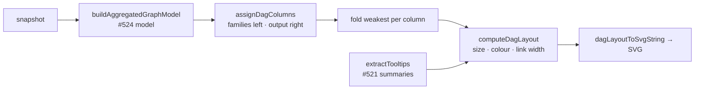

# Layered 2D DAG view with impact overlay (Issue #525)

## Summary

Adds `docs/dag/` — a phone-friendly, client-side layered DAG view of the
aggregated graph model (#524): observation families on the left, hidden layers
in topological order, the output on the right, with per-node impact encoded in
size **and** colour intensity and per-edge contribution encoded in link width.
It ships **alongside** the 3D starfield, which is untouched and still reachable
at `/graph/`. Closes #525.

- `docs/shared/dag_layout.js` — new DOM-free module: column assignment,
  geometry, tooltips, legend and SVG string. Reuses `TOPO_MIN/MAX_NODE_R` and
  `TOPO_MIN/MAX_LINK_W` from `shared/topology_diagram.js`,
  `divergingWeightSumColourCss` from `shared/colour_maps.js`, the log ramp from
  `shared/scale.js`, and `extractTooltips` / `buildObservationTooltip` from
  `shared/ui_helpers.js` (the #521 summaries).
- `docs/dag/{index.html,dag.js,dag.css,boot.js}` — mirrors the `docs/graph/`
  structure: strict CSP with `script-src 'self'`, boot script that registers the
  Service Worker before importing the view, default-snapshot auto-load with
  retry, `?noAutoLoad=1` and `?noSw=1` escape hatches.
- Aggregation is **consumed, not re-implemented** — `buildAggregatedGraphModel`
  does the family grouping, layering, impact attribution and low-impact
  collapse.

### Readability at full scale, without silent truncation

At the published snapshot scale the model still yields ~2,100 aggregate nodes in
one column, which renders as a wall rather than a diagram. The view therefore
draws the strongest nodes per column and folds the remainder into one grey
aggregate whose label states the count; edges into folded nodes are re-pointed
onto the aggregate and merged, so no traffic disappears. Every reduction is
reported in the summary line — dead neurons, model-collapsed neurons, and
view-folded nodes — so a reduced diagram can never read as "this is the whole
network". The header **Detail** control trades readability against completeness
(Coarse 8 rows / Balanced 12 / Fine 20 per column).

### Serving the three goals

- **Score composition** — column 0 is the observation families, sized by impact,
  with each node's share of its column in the tooltip and details panel.
- **Dead-zone discovery** — grey folded aggregates plus the summary counts of
  dead and collapsed neurons.
- **Troubleshooting** — tap a node (or use the keyboard-accessible _Inspect
  node_ picker) to see its kind, column, impact, share, link counts and member
  observation summaries.

## Evidence

Desktop (1280×900) and phone (390×844) captures of the real default snapshot,
taken with `scripts/capture_dag_evidence.ts` (Playwright) against the local
static server:

## Test Plan

New `tests/dag_view_test.ts` (21 cases), covering the failure-detection points
named in the issue:

- **Layering** — families are exactly column 0, the output is the right-most
  column, hidden nodes sit strictly between, and `assignDagColumns` still
  separates them in a degenerate 2-layer model.
- **Clamped encodings** — `dagNodeRadius` / `dagLinkWidth` stay inside
  `TOPO_MIN/MAX_NODE_R` and `TOPO_MIN/MAX_LINK_W` for `1e18`, `MAX_VALUE`,
  negative, `NaN` and `Infinity` inputs, and across a whole extreme-impact
  layout.
- **Tooltips** — node tooltips carry the `extractTooltips` label/description
  text via `buildObservationTooltip`, and degrade to the label when no summary
  exists.
- **Rendering** — one group and one `<title>` per node/edge, injected markup is
  escaped, output is deterministic, an empty model throws rather than rendering
  a blank diagram.
- **Folding** — a wide column folds to the row budget, the fold reports its
  member count, edges are re-pointed onto the aggregate without duplication, and
  a column under budget is untouched.

Existing suites extended:

- `tests/app_module_loads_test.ts` — now imports `docs/dag/dag.js` under browser
  stubs, so a duplicate-import/syntax error fails `deno test` instead of leaving
  the page on "Loading…".
- `tests/csp_meta_test.ts` and `tests/status_live_region_test.ts` — enumerate
  `docs/dag/index.html`.
- `tests/pwa_test.ts` — asserts the DAG assets exist, that `sw.js` precaches
  `./dag/boot.js`, that `/dag/` navigations resolve to the DAG shell, and that
  `inject_build_id.ts` rewrites the new files.
- `pa11yci.json` — adds `http://127.0.0.1:8080/dag/?noAutoLoad=1`.

`./quality.sh` passes: fmt, lint, type check, bash/shellcheck gates and 957
tests green.

## Security self-check

- All snapshot-derived text (labels, tooltips, node ids) is escaped with
  `escapeHtml` before it reaches SVG or panel markup — covered by an injection
  test.
- The page ships the same strict CSP as the other entry pages
  (`script-src 'self'`, `form-action 'none'`, no wildcard `connect-src`); no
  inline scripts.
- No new dependencies, no secrets, no new network origins.
