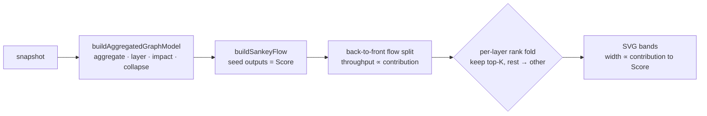

# Sankey contribution-flow view (candidate) — Issue #526

## Summary

Adds the **Sankey contribution-flow view** as a contrasting candidate to the
layered DAG, so the winner of #522 can be chosen by side-by-side comparison. The
view draws contribution **flow** — observation families → hidden layers → output
— with each band's width proportional to its contribution to the Score. It
consumes the aggregated layered graph model from the sibling sub-issue (#524),
is client-side only, phone-friendly, and ships as a static GitHub Pages page
alongside the trace explorer, the 3D graph and the starfield.

`Closes #526.`

The maths live in a DOM-free helper (`docs/shared/sankey_flow.js`) so the flow
contract is unit-tested; the browser view (`docs/sankey/`) only does SVG
geometry.

### What was built

- **`docs/shared/sankey_flow.js`** — `buildSankeyFlow(model)` turns the
  aggregated model into a **conserved** Sankey. Output nodes are seeded with
  their impact (the Score); walking layers back-to-front, each node's throughput
  is split across its inbound edges in proportion to the edge's contribution
  (`computeImpactBreakdownToOutputs` / the model's edge impacts). Because every
  node's inbound bands sum to its throughput, the layer-0 family bands sum back
  to the Score — a proportional decomposition of the Score. `bandWidth()` is the
  linear value→pixel scale.
- **Aggregation-first at scale.** The model already collapses low-impact hidden
  neurons; the view additionally folds each layer's low-contribution tail into
  one per-layer "other" node (`maxNodesPerLayer`). Without this, the published
  snapshot's inputs explode into **2,132 single-observation families** (they
  carry no tooltip `group`), so layer 0 alone had 2,133 nodes. After folding the
  default snapshot renders **47 nodes / 551 flows** (from 4,120 neurons / 21,492
  synapses) — legible.
- **`docs/sankey/`** — `index.html`, `boot.js`, `sankey.js`, `sankey.css`: a
  self-contained SVG Sankey. Strict CSP (`script-src 'self'`), auto-loads the
  default snapshot, URL/file loaders, light/dark themes, phone-friendly wrapping
  and a horizontally-scrollable diagram. Tooltips reuse the #521
  observation-summary format (`buildObservationTooltip`).
- **Wiring** — service-worker precache + navigation route for `docs/sankey/`,
  `pa11yci.json` entry, a link from the trace explorer's overflow menu, and the
  `deno lint` browser-renderer exclusion (matching graph/starfield).

### Serving the three goals

- **Score composition** — the primary Sankey strength: proportional flow into
  the Score, conserved back to the observation families.
- **Dead-zone discovery** — thin/absent bands stand out against the dominant
  pathways.
- **Troubleshooting** — a family's band traces forward through the hidden layers
  to the output.

## Evidence

Desktop and mobile, rendering the default snapshot's contribution flow
(aggregated and readable):

### Deno regression avoided

- Built the view on Deno-native tooling (`deno test`/`fmt`/`lint`/`check`) and
  the existing shared ES modules — no Node bundler, `package.json`, or npm test
  runner introduced.

## Test Plan

New `tests/sankey_view_test.ts` (16 cases, run by `./quality.sh`) loads fixtures
through `buildAggregatedGraphModel` + `buildSankeyFlow` and asserts:

- the flow data builds without throwing, and fails loudly on a missing/malformed
  model;
- **band width ∝ contribution**: the stronger pathway carries more flow, and
  `bandWidth` is strictly linear (pixel ratio = flow ratio); `hidden-A`'s band
  matches the model's allocation share;
- **family→output flow sums to the Score total** — flow into the outputs, the
  layer-0 source flow, and every node's inbound/outbound bands are conserved;
- **low-impact flows collapse within the readability budget** — a snapshot
  scaled toward 200 weak hidden neurons stays within the node/link budget with a
  collapsed node present, and a 60-family snapshot folds layer 0 to the
  per-layer budget plus one "other" node **without losing the tail** (Score
  still conserved);
- tooltips match #521; the model is deterministic.

A regression in the model's edge weights or the aggregation logic fails these
before merge. Full `./quality.sh` passes (fmt, lint, type-check, 940 tests).
