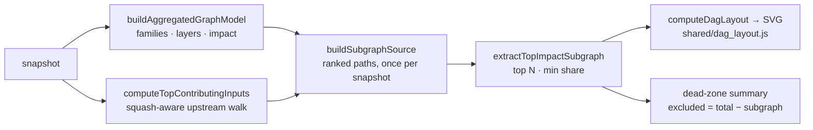

# Top-impact subgraph view (candidate) — Issue #527

## Summary

Added the **top-impact subgraph view** as the third candidate replacement for
the 3D starfield. Instead of drawing the whole network, it extracts only the
highest-contributing paths to the Score and states, in exact numbers, how much
of the network that leaves out. Closes #527.

- **`docs/shared/subgraph_model.js`** (new, DOM-free) — two stages so the
  expensive half runs once per snapshot and the N/threshold control re-runs only
  the cheap half:
  - `buildSubgraphSource` aggregates the network via `buildAggregatedGraphModel`
    (family grouping, layers, per-node/per-edge impact) and ranks every
    observation by its squash-aware contribution to the output via
    `computeTopContributingInputs` (`shared/graph_analysis.js`).
  - `extractTopImpactSubgraph` takes the top N ranked paths that clear the
    impact threshold and carves the matching nodes and edges out of that model.
  - `describeSubgraphPath` and `subgraphLegendHtml` provide the drill-down and
    legend text.
- **`docs/subgraph/`** (new page) — `index.html`, `subgraph.js`, `subgraph.css`,
  `boot.js`, following the DAG view's structure (strict CSP, extracted boot
  script, PWA precache, auto-load with retry).
- **Rendering is reused, not re-invented** — the extracted subgraph is shaped
  like an aggregated graph model, so it renders through the existing
  `shared/dag_layout.js` with the same impact-encoded nodes/edges and the same
  Issue #521 observation tooltips as the DAG view.

### Serving the three goals

| Goal                | How                                                                                                                                   |
| ------------------- | ------------------------------------------------------------------------------------------------------------------------------------- |
| Score composition   | Top contributors by construction; the summary states what share of the Score the drawn paths explain.                                 |
| Dead-zone discovery | The Dead zones panel counts every excluded observation, neuron and aggregate node, plus the neurons with no path to the Score at all. |
| Troubleshooting     | Picking a path (or tapping a node) shows the observation summary, its share of the Score, and the full neuron chain.                  |

### Fail-loud behaviour

- `buildSubgraphSource` throws when the snapshot carries no creature, declares
  no output, or when no observation can be attributed to the output — none of
  these degrade into a blank diagram.
- An empty result from a high threshold is a legitimate control setting, so it
  is reported honestly (whole network in the dead zone, plus on-screen guidance)
  rather than thrown or silently widened to the strongest path.
- When the attribution walk hits its work cap, the summary line says the ranking
  is truncated instead of presenting it as complete.

## Evidence

On the default published snapshot the default settings draw **12 paths — 25
nodes and 24 links out of 4,120 neurons**, with 4,095 neurons reported as
excluded.

Screenshots captured with Playwright against the real default snapshot
(`scripts/capture_subgraph_evidence.ts`):

`./quality.sh` passes: 994 tests, 0 failures.

## Test Plan

New `tests/subgraph_view_test.ts` (24 tests) exercising the real extraction
functions against a six-observation / three-family fixture:

- **Top-N extraction** — non-empty and impact-ordered; every path runs from an
  observation to the output; top-2 keeps exactly the two strongest contributors;
  nodes/edges are a consistent subset of the aggregated model with no dangling
  endpoints; the output node is always rendered; observations are grouped into
  families.
- **Dead-zone arithmetic** — `excluded === total − subgraph` for nodes, neurons
  and observations; widening the extraction shrinks the dead zone; unreachable
  neurons are reported separately.
- **Controls** — changing N changes the extracted set; raising the threshold
  drops the weakest paths; a threshold above every score yields an explicit
  empty subgraph; defaults work with no options.
- **Fail-loud** — throws on a missing creature and when no observation reaches
  the output.
- **Rendering + tooltips** — the subgraph renders through `computeDagLayout` /
  `dagLayoutToSvgString` with the output right-most; node tooltips carry the
  Issue #521 observation summaries; `describeSubgraphPath` renders the summary,
  share and hop chain; extraction is deterministic.
- **Multi-output** — contributions sum across outputs and stay normalised.

Existing gates extended to cover the new page:

- `tests/pwa_test.ts` — page assets exist, `/subgraph/` navigation resolves to
  its own shell, `boot.js` is precached, and `inject_build_id.ts` rewrites it.
- `tests/csp_meta_test.ts`, `tests/status_live_region_test.ts`,
  `tests/page_title_test.ts` — CSP, live-region and unique-title contracts.
- `tests/app_module_loads_test.ts` — module-load smoke test for
  `docs/subgraph/subgraph.js`.
- `pa11yci.json` — `/subgraph/?noAutoLoad=1` added to the WCAG 2 AA run.

Shared-helper regressions remain covered by the existing
`tests/attribution_walk_test.ts` and
`tests/selection_squash_allocation_test.ts`.

## Security self-check

- No new external input: the page loads snapshots through the existing
  `fetchSnapshotJson` / `readSnapshotFile` helpers and the same allow-listed
  origins.
- All rendered text passes through `escapeHtml` (view) or the shared SVG
  serialiser, which already escapes labels and tooltips.
- Same strict CSP as the other app shells (`script-src 'self'`, no inline
  script, `form-action 'none'`), verified by `tests/csp_meta_test.ts`.
- No new dependencies, no secrets, no shell/SQL/filesystem surface.
