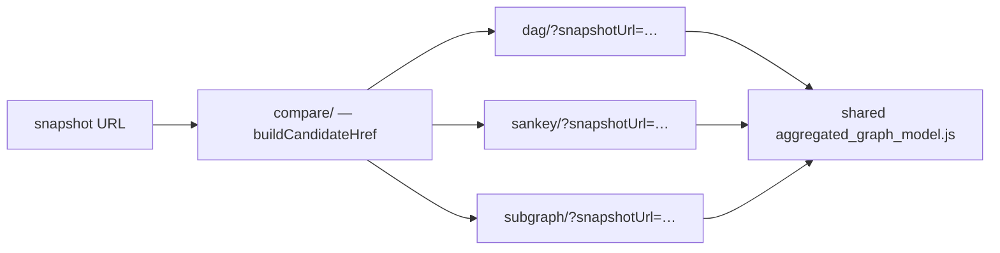

## Summary

Delivers the **side-by-side candidate comparison and winner selection** for the
#522 graph-view redesign. Closes #528.

The three candidate replacement views (layered DAG, Sankey, top-impact subgraph)
are now reachable and comparable on the **same** snapshot, and the evaluation
ends in a recommended winner:

- **New comparison hub `/compare/`** — loads one snapshot URL and wires every
  candidate to it (as launcher cards and as side-by-side `<iframe>`s) through
  the shared `snapshotUrl` contract, so the three are judged on identical data.
  Discoverable from the overview dashboard's *Compare graph views* action.
- **New top-impact subgraph view `/subgraph/`** — the third candidate (#527)
  did not yet exist, and the comparison's "all three reachable" acceptance
  needs it. It keeps only the highest-impact nodes on the paths to the Score and
  reports everything it drops as a candidate **dead zone** (2,154 of 2,167
  aggregated nodes on the default snapshot), with a `Top paths (N)` slider.
- **Shared `snapshotUrl` resolver** — `resolveSnapshotUrlFromParams` in
  `snapshot_loader.js` is now the single source of truth for the
  `snapshotUrl`/`snapshotUrlB64`/`file` contract. The **DAG view now honours
  it** (previously it always loaded the default), so a custom snapshot really
  propagates to every candidate.
- **Documented evaluation + winner** — `docs/archive/candidate-view-evaluation-528.md`
  scores each candidate against the three #522 goals plus phone-friendliness and
  future per-stock growth, and recommends the **layered DAG** as the primary
  replacement (keeping the Sankey and subgraph as complementary lenses).

All client-side; `./quality.sh` passes. This PR also delivers the substance of
#527 (the subgraph view) so the three-way comparison is genuine.

## Evidence

Comparison hub (desktop) — three candidate cards on one snapshot:

Comparison hub (phone) — cards stack single-column:

Top-impact subgraph on the live default snapshot — top 12 paths, dead-zone
summary:

## Test Plan

DOM-free cores are unit-tested (real functions, real data — no source grepping):

- `tests/subgraph_view_test.ts` — `buildTopImpactSubgraph`: non-empty
  impact-ordered subgraph that always keeps the output; `deadZoneCount` equals
  total minus kept; changing N monotonically grows a superset; edges survive
  only when both endpoints do.
- `tests/candidate_comparison_test.ts` — the chooser lists all three
  candidates; each link propagates the snapshot and round-trips through
  `resolveSnapshotUrlFromParams`; dangerous URL schemes are refused; all three
  candidate cores mount against one snapshot fixture without throwing.
- `tests/pwa_test.ts` — extended so the SW precaches and routes the new
  `/subgraph/` and `/compare/` shells and their `boot.js`, and the build-id
  injector rewrites them.

Full gate: `./quality.sh` — fmt, lint, `deno check`, and 986 tests pass.
Screenshots captured with `scripts/capture_issue_528_evidence.ts`.
