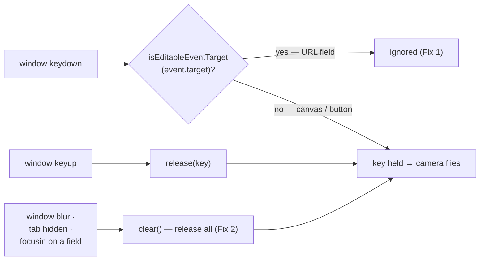

# Minimal starfield usability fixes (#529)

## Summary

Two small, low-risk keyboard papercuts in the 3D starfield (`docs/graph/`), plus
a repair to the issue's own manual acceptance gate. No re-architecture — the
starfield is slated for eventual retirement, so this is maintenance only. Closes
#529.

**Fix 1 — typing a snapshot URL flew the camera.** The `keydown` handler guarded
only the zoom keys against text fields; `this.keys.add(e.key.toLowerCase())` ran
unconditionally. Pasting or typing any URL containing `w`, `a`, `s`, `d`, `q` or
`e` therefore flew the camera away from the focused neuron while you were still
typing. Measured drift on the unfixed build: **6.98 world units** for a single
realistic URL.

**Fix 2 — stuck movement keys.** Hold `W`, switch tab or window, and the `keyup`
never arrives — the key stays "held" and the camera drifts indefinitely until
you come back and press-and-release it. The camera now releases every held key
on `blur`, on the tab becoming hidden, and when focus moves into a text field.
Measured drift on the unfixed build: **22.91 world units** in 800 ms, still
accelerating.

**Fix 3 — `scripts/verify_starfield_layout.ts` could not run.** The issue names
this script as the per-fix runtime acceptance check, but it aborted with an
`EvalError` before taking a single screenshot — on `Develop`, not because of
this change. Its browser-side predicates were passed to `waitForFunction` as
source strings, and `waitForFunction` re-evaluates a string predicate _inside
the page_ on every poll, which `docs/graph/index.html`'s `script-src 'self'` CSP
blocks. They are now real functions that reach page globals through
`globalThis`, so the file still type-checks without pulling `lib.dom` into the
program. **The CSP was deliberately not weakened** — adding `unsafe-eval` to
make a test script work would have been a security regression.

### Where the rules live

`docs/shared/keyboard_nav.js` is a new DOM-free module holding both rules, so
they are unit-testable (`docs/graph/graph.js` needs a browser, and is
lint-excluded in `deno.json`, so nothing else would have caught a regression).



## Evidence

`docs/evidence/_issue_529_shot.ts` drives the real graph view in Chromium
against the default snapshot (2,461 inputs / 21,492 synapses) and reads the
camera position straight off the new `__neatStarfield.getCameraPosition()` debug
getter, so the verdicts below are measured, not asserted. The script exits
non-zero if any check fails.


Run against **this** branch — all five checks pass:

```text
PASS  Typing "https://stsoftwareau.github.io/NEAT-AI-Snapshot/wasdqe.gz" moved the camera 0 world units (expected 0).
PASS  No camera keys are held after typing (expected 0, got 0).
PASS  Holding W over the canvas flies the camera (1 key held, got 1).
PASS  Window blur released the stuck key (expected 0, got 0).
PASS  Camera stayed put after blur (drifted 0 world units, expected 0).
```

Run against the **unfixed** behaviour (target guard and blur listeners
temporarily disabled) — the same script reproduces both bugs, which is what
makes it a regression check rather than a screenshot:

```text
FAIL  Typing "https://stsoftwareau.github.io/NEAT-AI-Snapshot/wasdqe.gz" moved the camera 6.977755298088317 world units (expected 0).
PASS  No camera keys are held after typing (expected 0, got 0).
PASS  Holding W over the canvas flies the camera (1 key held, got 1).
FAIL  Window blur released the stuck key (expected 0, got 1).
FAIL  Camera stayed put after blur (drifted 22.907499999999914 world units, expected 0).
3 check(s) failed.
```

The repaired acceptance gate also runs clean, confirming no render regression —
graph.js still loads the snapshot, focuses, and draws:

```text
$ deno run -A scripts/verify_starfield_layout.ts
Wrote docs/screenshots/graph-desktop.png
Wrote docs/screenshots/graph-desktop-focus.png
Wrote docs/screenshots/graph-desktop-tilt.png
```

(The regenerated `docs/screenshots/graph-desktop*.png` are byte-level re-renders
of an animated canvas with no visual change, so they are left out of this diff.)

`./quality.sh` passes: **1024 tests, 0 failed**, plus format, lint, type check,
`bash -n` and ShellCheck.

## Test Plan

New — `tests/keyboard_nav_test.ts` (14 tests against
`docs/shared/keyboard_nav.js`, using real deno-dom elements rather than source
greps):

- `normaliseKeyName` — case folding; `null`/`undefined` keys.
- `isEditableEventTarget` — true for `input`/`textarea`/`select` and inside a
  `contenteditable` host; honours `contenteditable="false"`; **false** for
  buttons, links and the canvas (pressing `W` with the Zoom button focused must
  still fly the camera); false for `null`/`undefined`.
- `createFlyKeyState` — **Fix 1**: `press` ignores `w`/`a`/`s`/`d`/`q`/`e` and
  `ArrowRight` aimed at the snapshot URL input, and records them over the
  canvas. **Fix 2**: `clear()` releases every held key. Also: `release` is never
  target-guarded (a keyup landing on an input must still free the key),
  duplicate presses hold once, and a missing key name is ignored.

Existing suites that already pin this surface and still pass unchanged:
`tests/sw_static_files_test.ts` (the new shared module is registered in
`docs/sw.js` `STATIC_FILES`), `tests/pwa_test.ts`,
`tests/verify_starfield_layout_check_test.ts` (`deno check` of the repaired
script), `tests/hud_aside_label_test.ts`, `tests/status_live_region_test.ts`.

No existing test was modified, commented out or removed.

## Security self-check

- **Input validation** — `isEditableEventTarget` and `normaliseKeyName` accept
  `unknown` and null-guard before any property access; no untrusted value is
  interpolated anywhere.
- **CSP** — deliberately left at `script-src 'self'`; the verifier was fixed to
  stop needing `eval`, rather than the policy being relaxed to permit it.
- **Debug API** — `getCameraPosition()` / `getHeldKeyCount()` are read-only
  numeric getters on the existing, intentionally shipped `__neatStarfield`
  surface. No new network, storage, DOM-injection or dependency surface.
- **Secrets** — none staged; no hidden files in the diff.
