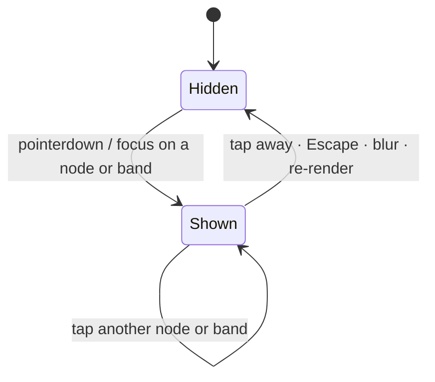

# Sankey: wire the touch tooltip panel (Issue #536)

## Summary

`docs/sankey/index.html` declared `
` and `sankey.css` styled
it, but nothing ever populated it — the only tooltip mechanism wired was the SVG
`<title>` child, which renders on hover and **never on touch**. On a phone the
#521 observation summaries built by `buildNodeTooltip` were therefore
unreachable. This PR drives that panel. Closes #536.

- **New `docs/sankey/tooltip_panel.js`** — a small, DOM-shaped but
  framework-free controller: `createTooltipController`, `attachTooltipTrigger`,
  `attachTooltipDismissers`, plus the pure `clampTooltipPosition` /
  `anchorPoint` helpers. No sibling candidate had a shared helper, so per the
  issue the wiring stays local to `docs/sankey/`.
- **`docs/sankey/sankey.js`** passes the _same_ string to both paths: a node's
  `node.tooltip` and a band's title text go to the `<title>` child **and** to
  the panel. `buildNodeTooltip` in `docs/shared/sankey_flow.js` remains the
  single source of truth — no tooltip text is rebuilt here.
- **Additive only** — SVG `<title>` (desktop hover) and each group's
  `aria-label` (screen readers) are untouched.
- **Clamped to the viewport** so the panel is not clipped at the SVG edges on a
  narrow screen; the panel is also hidden on re-render, so it can never describe
  a node that no longer exists.
- **Fail loud (#3234)** — a missing panel element throws from the controller,
  and `sankey.js` reports it via `console.error` rather than silently dropping
  touch tooltips.

### Out-of-scope fix required to get a green gate

`tests/candidate_comparison_test.ts` imported `buildTopImpactSubgraph`, which
`docs/shared/subgraph_model.js` does not export (it exports
`extractTopImpactSubgraph`, which takes a snapshot/source rather than an
aggregated model). That broke `deno check` — and therefore `./quality.sh` — on
the milestone branch before this change. Fixed in two lines so the gate passes.
`docs/archive/pr-summaries/pr-summary-528.md` was also re-run through `deno fmt`
for the same reason.

## Evidence

State transitions the panel now implements:

Phone viewport (390 × 844, touch-enabled) — tapping an observation family shows
the #521 summary, clamped inside the visible area:

Desktop (1280 × 900) — the same panel on click, with hover `<title>` unchanged:

Screenshots captured with `scripts/capture_sankey_tooltip_evidence.ts`
(Playwright) against `deno run -A ./helpers/server.ts 8091 docs`.

## Test Plan

New `tests/sankey_tooltip_panel_test.ts` (10 tests) — the panel element under
test is parsed from the published `docs/sankey/index.html`, so renaming or
deleting it fails CI:

| Test                                                           | Covers                                                                   |
| -------------------------------------------------------------- | ------------------------------------------------------------------------ |
| the panel shows exactly the node's tooltip string              | `panel.textContent === node.tooltip` (equality — the paths cannot drift) |
| tapping a node shows the panel; tapping elsewhere dismisses it | tap → shown, tap-away → hidden                                           |
| tapping inside the node (its rect child) keeps the panel open  | the dismisser ignores taps within a trigger                              |
| Escape dismisses the panel                                     | `Escape` hides; an unrelated key does not                                |
| keyboard focus shows the same panel, and blur hides it         | focus/blur transitions                                                   |
| a band's tooltip text is shown on tap                          | link bands are wired too                                                 |
| blank tooltip text leaves the panel hidden                     | empty-text guard                                                         |
| the panel is clamped inside a phone-width viewport             | right/bottom edge, top-left edge, panel wider than viewport              |
| showing the panel writes the clamped position onto the element | the clamped position actually reaches the DOM                            |
| createTooltipController fails loudly without a panel element   | missing panel throws rather than failing silently                        |

`./quality.sh` passes: fmt, lint, `deno check`, 1041 tests, 0 failures.
