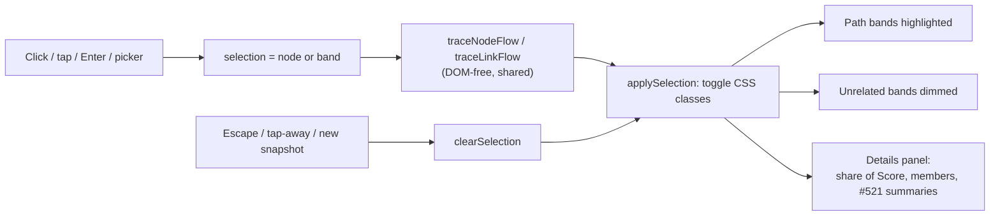

# Sankey: click/tap to trace a family's flow to the output

## Summary

The Sankey view (PR #532) rendered once and was inert — with ~47 nodes and ~551
overlapping bands you could not follow a single observation family through the
hidden layers to the Score. This adds the third #526 goal, **troubleshooting**:
click/tap (or keyboard) a node to highlight its **full flow path** to the output
and dim everything else, with a details panel reporting the selection's share of
the Score. It brings the Sankey to parity with the sibling DAG candidate so the
#522/#528 side-by-side comparison is fair.

The path-tracing traversal is kept DOM-free in `docs/shared/sankey_flow.js`
(`traceNodeFlow` / `traceLinkFlow`), unit-tested under Deno;
`docs/sankey/sankey.js` only applies the resulting CSS classes and renders the
panel.

Closes #537.

### What changed

- **`docs/shared/sankey_flow.js`** — new `traceNodeFlow(flow, nodeId)` walks
  every band feeding a node back to its source families (upstream) and every
  band flowing from it through to the output (downstream), returning the exact
  band and node ids on that path. An isolated node traces to just itself.
  `traceLinkFlow(flow, linkId)` returns a band with its two endpoints.
- **`docs/sankey/sankey.js`** — module-scope selection state; node groups tagged
  `data-node-id`, bands tagged `data-link-id`; click/tap, keyboard
  (`Enter`/`Space` on a focused node), node picker, and `Escape`/tap-away
  clearing; a details panel showing label, throughput, **share of the Score**,
  member count and the #521 observation summaries. Selection survives a
  re-render of the same snapshot and clears when a new snapshot loads.
- **`docs/sankey/index.html`** / **`docs/sankey/sankey.css`** — details panel +
  node picker markup and styling; highlight (`isHighlighted`/`isOnPath`/
  `isSelected`) and `isDimmed` classes.

### Data flow

## Evidence

Selecting the observation family `volume-best-fit-30-1825` traces its flow to
the Score (highlighted path, unrelated bands dimmed); the panel reports its 4.2%
share of the Score, throughput, member count and the #521 observation summary.

Captured with `scripts/capture_issue_537_evidence.ts` (Playwright headless
Chromium against a local `docs/` server).

## Test Plan

Added to `tests/sankey_view_test.ts` (all pass; full `./quality.sh` green — 1048
tests):

- `traceNodeFlow returns exactly the reachable upstream and downstream bands` —
  a hand-checkable A/B→H→OUT fixture; asserts the exact upstream, downstream and
  combined band ids plus every node on the path.
- `traceNodeFlow follows a family all the way to the output` — a source node
  traces downstream through to the output.
- `traceNodeFlow traces an isolated node to itself with no bands` — the empty
  trace for an unconnected node.
- `traceNodeFlow on a real snapshot: the output pulls in every band` — from a
  real aggregated model, the output's upstream trace is every link.
- `traceLinkFlow highlights a band and both its endpoints` and its unknown-band
  and no-links edge cases.

Keyboard-only operation (focus a node → `Enter`/`Space` to select → read the
panel → `Escape` to clear) is wired via the focusable node groups and a
document-level `Escape` handler; the details panel is keyboard-reachable.
