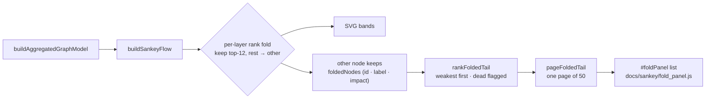

# Sankey: make the folded "other" node inspectable (Issue #538)

## Summary

The Sankey's per-layer rank fold keeps the diagram readable, but it collapsed
each layer's tail — 2,121 observation families on the published snapshot — into
a single opaque band whose only description was "N minor observation families".
That worked directly against #526's **dead-zone discovery**: a member with zero
throughput was indistinguishable from one that was merely out-ranked, so "which
observations contribute nothing?" could not be answered from this view.

The fold itself is unchanged (the conserved-flow contract and the readability
budget stay exactly as they were). What changed is that the fold is no longer a
dead end:

- `foldLowRankNodes` now retains each folded node's own identity (`foldedNodes`:
  id, kind, label, impact, member count) instead of only the flattened
  observation UUIDs, and the rendered node carries `otherCount` / `foldedNodes`.
- `rankFoldedTail(node, { totalScore })` — new DOM-free export from
  `docs/shared/sankey_flow.js` — splits the folded band's throughput across its
  members in proportion to impact, returning them **ranked ascending** with each
  member's `value`, `share` of the Score and an `isDead` flag. The shares sum
  back to the band, so the tail is decomposed rather than approximated away.
- `pageFoldedTail(ranked, { offset, pageSize })` slices one page (default 50),
  clamping out-of-range offsets rather than returning a blank list.
- `docs/sankey/fold_panel.js` renders that page into the new `#foldPanel`
  markup: weakest first, dead members marked `no flow — dead`, with a pager and
  Escape/close dismissal. Exactly one page is ever in the DOM, so the work per
  page is constant.

Selecting a folded band now names the dead observations directly — on the
published snapshot, 120 of the 2,121 folded members carry no flow at all.

A deliberate honesty guard: when a fold carries flow but no member has any
attributed impact there is no ranking signal, so the split is even, `basis` is
`"even"`, and **nothing** is called dead — a fabricated dead-zone verdict would
be worse than none.

Closes #538.

## Evidence

Captured with Playwright against the real published snapshot via
`scripts/capture_issue_538_evidence.ts`, run against a local `helpers/server.ts`
on port 8091.

Desktop — 2,121 folded members, 120 of them dead, named and ranked:

Phone (390×844) — the same list, one bounded page, no lock-up:

## Test Plan

`./quality.sh` passes (fmt, lint, type check, 1,055 tests).

New tests in `tests/sankey_view_test.ts` (DOM-free helper):

- `the folded 'other' node carries its folded members for inspection` — one
  entry per folded node, `foldedNodes.length === otherCount`.
- `rankFoldedTail ranks folded members weakest-first with their share of the
  Score`
  — ascending order, entry count equals `otherCount` (folded members cannot be
  silently lost), and the shares sum back to the band's throughput.
- `zero-flow folded members are identifiable as dead, not merely minor` — the
  six zero-weight families are flagged `isDead`, rank first, and every live
  member keeps a positive share.
- `rankFoldedTail is deterministic and fails loudly on a node that is not a
  fold`.
- `pageFoldedTail pages a large fold so the list never renders it all at once` —
  a 2,128-member fold pages at 50, first/last page flags, offset clamping.

New tests in `tests/sankey_fold_panel_test.ts` (panel contract):

- selecting a folded node lists it weakest-first with each share of the Score;
- members with no flow are marked dead and lead the list;
- a 2,128-member fold keeps exactly one page of 50 in the DOM, and the pager
  walks it;
- click and Enter both open the list; the close button and Escape dismiss it;
- a thin contribution renders as `<0.01%`, never as `0%` (a thin flow must not
  read as a dead one);
- an unrankable fold says so instead of inventing dead zones;
- missing panel markup throws instead of silently dropping the fold;
- the published `docs/sankey/index.html` really declares the panel the view
  drives.

Fixtures build a snapshot with a known mix of small-but-nonzero and zero-flow
families, so a regression in the fold, the ranking, or the dead-flagging fails
in CI before merge — the failure-detection contract from the issue.
