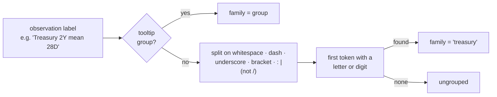

# Observation families: group by the leading subject token

## Summary

`deriveObservationFamily` derived a family key from the tooltip `group`, then
from the label's leading segment split on `/\s+[—–-]\s+|[:/|]/`. The published
snapshot supplies **no** tooltip `group` at all, and none of its labels contain
those separators, so step 2 returned the whole label — every observation became
its own family (**2,132 singletons** at layer 0). PR #532's rank-based folding
kept the diagram legible, but what it drew was "the top 12 individual
observations plus everything else", not the family decomposition #526 asked for.

The published labels do carry structure: all three dialects put the **subject
first** and the statistic/window last.

| Label                                           | Family                      |
| ----------------------------------------------- | --------------------------- |
| `close-best-fit-30-7`, `divYieldYr-0`           | `close`, `divyieldyr`       |
| `EMVMACROTRADE mean 9M`, `Treasury 2Y mean 28D` | `emvmacrotrade`, `treasury` |
| `P/E ratio (TTM) trend (4 quarters)`            | `p-e`                       |

So the fallback now takes the **leading subject token**: whitespace, dashes,
underscores, brackets and `:`/`|` end the subject, and the first token carrying
a letter or digit wins (a punctuation-only leader is skipped rather than
swallowing the whole label). `/` is deliberately _not_ a token boundary, so
ratio labels keep their identity instead of collapsing into a meaningless `p`.

On the published snapshot this takes layer 0 from **2,132 families to 232**,
with all 2,190 kept observations still accounted for. Explicit tooltip `group`
still takes precedence, so the change is inert once the snapshot producer
supplies `group` metadata. The fix is in the shared `observation_families.js`,
so the DAG and subgraph candidates inherit it too.

Closes #539.

## Evidence

**Before** — layer-0 bands are individual observations
(`volume-best-fit-30-18…`, `volume-recommend`, `Dividend coverage by …`) and the
fold swallows 2,121 of them:

**After** — layer-0 bands are families (`volume`, `dividend`, `sentiment`,
`industry`, `earnings`, `sugar`, `tax`) and the fold drops to 221 members:

Full page for context:

Screenshots captured with `scripts/capture_issue_539_evidence.ts` (Playwright,
dark scheme, 4× device scale for the layer-0 close-up) against
`deno run -A ./helpers/server.ts 8091 docs` and the live default snapshot.

Measured against the published snapshot
(`https://stsoftwareau.github.io/NEAT-AI-Snapshot/snapshot.json.gz`) via
`buildAggregatedGraphModel`:

| Metric           |                   Before |                      After |
| ---------------- | -----------------------: | -------------------------: |
| Layer-0 families |                    2,132 |                        232 |
| Members retained |                    2,190 |                      2,190 |
| Top band         | `volume-best-fit-30-18…` | `volume` (80 observations) |

### Deno regression avoided

Evidence capture reuses the repo's existing Deno + Playwright script pattern
(`deno run -A scripts/capture_issue_539_evidence.ts`); no npm/npx tooling was
introduced.

## Test Plan

New `tests/observation_family_corpus_test.ts` — runs the derivation over the
committed `docs/tooltips.json`, which is byte-for-byte the published snapshot's
`tooltips` map (verified against the live snapshot), so the guard needs no
network:

- `published snapshot labels collapse to a readable family count` — asserts ≤
  400 families, ≥ 20 families, and at least a 5× collapse. Fails against the
  unfixed code (2,441 families), which is the regression test for this issue.
- `no observation is dropped when the corpus is grouped` — summed `memberCount`
  equals the observation count and every UUID is present, so a derivation that
  silently drops observations fails before merge.
- `the corpus yields recognisable, well-populated families` — `close`, `volume`,
  `treasury`, `sentiment` and `dividend` each aggregate ≥ 10 observations; `p-e`
  exists and a bare `p` does not; nothing lands in `ungrouped`.
- `grouping the corpus is deterministic` — repeated calls are identical and
  families come back key-sorted.

Extended `tests/observation_families_test.ts`:

- `deriveObservationFamily reads the published label dialects (Issue #539)` —
  one case per dialect (hyphenated series, code + statistic, prose fundamental).
- `deriveObservationFamily keeps ratio labels intact (Issue #539)` — `P/FCF` and
  `P/E` stay distinct.
- `deriveObservationFamily skips leading tokens with no letters or digits` —
  `"— Momentum 30 day"` → `momentum`; `"  ---  "` → `ungrouped`.

Existing tests (tooltip `group` precedence, custom `deriveFamily`, member
ordering, non-string UUIDs) are unchanged and still pass. `./quality.sh` is
green: 1,064 tests, 0 failures.
