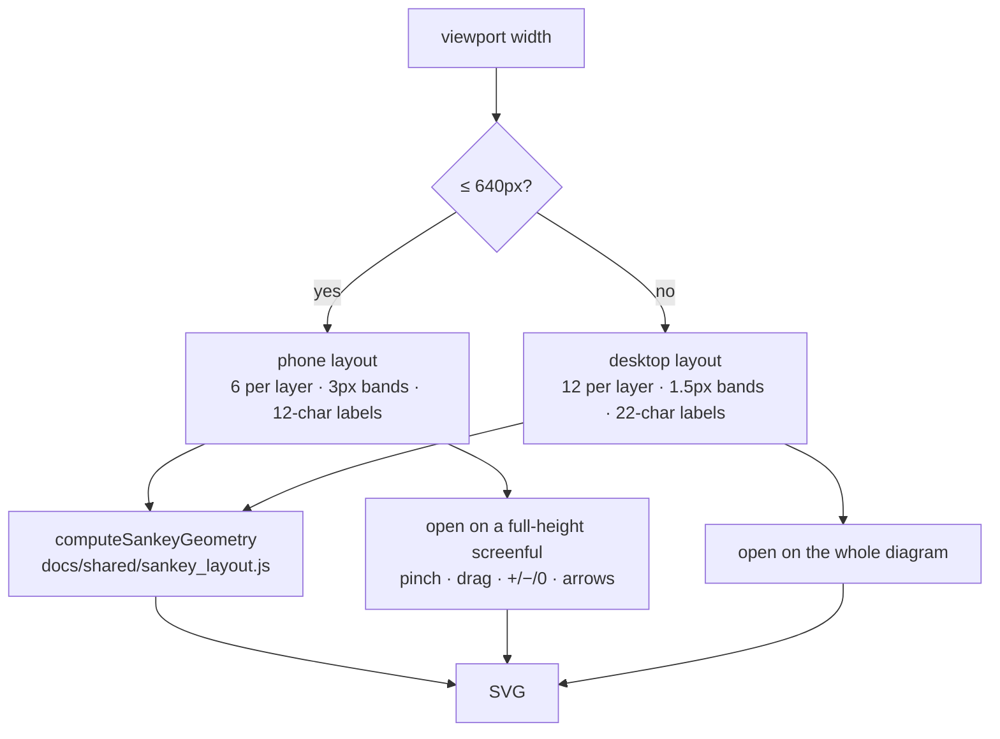

# Sankey: phone-friendly layout — zoom/pan and width-based media rules

## Summary

The Sankey view was laid out for a desktop canvas and merely shrank to fit a
phone: a fixed `viewBox` of `0 0 ${viewWidth} 620`, 12 nodes per layer,
22-character labels, 1.5 px bands and an `h >= 8` label threshold, with no
width-based `@media` rule at all. On the published snapshot — which lays out as
**33 layers** — that produced a 44 px-tall illegible strip on a 390 px viewport.

This PR gives a phone a _different_ layout rather than a smaller one, and adds a
zoom/pan window so a thin band can be magnified to something reachable. **Closes
#540.**

- **Responsive constants** (`docs/shared/sankey_responsive.js`) — one breakpoint
  at 640 px (`PHONE_MAX_WIDTH`, shared with the CSS), picking the per-layer fold
  budget (6 vs 12), band and node floors (3 vs 1.5, 14 vs 16), label truncation
  (12 vs 22 chars), label-visibility threshold (10 vs 8) and view box. Halving
  the per-layer budget is what buys legibility: the same vertical space split
  six ways roughly doubles each band, so labels clear the threshold instead of
  being dropped. An unmeasurable viewport throws rather than silently shipping
  the desktop canvas to a phone.
- **Geometry lifted out of the renderer** (`docs/shared/sankey_layout.js`) — the
  node rectangles, band thicknesses and label decisions used to be computed
  inline while building SVG, so CI could not assert them. `sankey.js` is now a
  thin SVG adapter over `computeSankeyGeometry`. The maths is copied verbatim,
  parameterised by the constants above.
- **Zoom/pan** (`docs/shared/viewbox_zoom.js` + `docs/sankey/zoom_pan.js`) — the
  view state is the `viewBox` window itself in content units, with its aspect
  ratio pinned to the rendered pane so nothing is letterboxed or distorted. The
  phone opens on a **full-height screenful** anchored at the observation
  families on the left; the desktop keeps its whole-diagram fit-to-width view
  untouched. Pinch, one-finger drag, wheel, the `+`/`−`/`Reset` buttons and the
  `+`, `−`, `0` and arrow keys all drive the same window. A drag is not mistaken
  for a tap, so panning no longer clears the selection.
- **Width-based `@media` rules** (`docs/sankey/sankey.css`) — the header
  controls, legend, zoom hint and meta line reflow; the diagram becomes a
  bounded 62vh pane with no sideways page overflow.
- The view re-lays out when a rotation crosses the breakpoint, keeping the live
  selection when the node survives the new fold budget.

### Layout decision

## Evidence

Captured with Playwright at a real 390×844 phone viewport against the default
snapshot (`deno run -A scripts/capture_issue_540_evidence.ts`). Horizontal page
overflow measured **0 px** on every shot.

Phone, as it opens — one full-height screenful of the 33-layer diagram, labels
legible, bands reachable, chrome reflowed to a single column:

Phone, magnified to 338% through the keyboard-reachable zoom button (the same
window a pinch produces):

Desktop, unchanged apart from the new zoom control row:

Interactively verified in the same phone context: tapping a band still selects
and traces it (`svg.sankey.hasSelection` present, details panel populated), the
zoom button responds to `Enter`, and the console is clean.

## Test Plan

New tests (42 in total, all failing before this change because the modules and
the layout decisions did not exist):

- `tests/sankey_responsive_test.ts` — the failure-detection contract from the
  issue. Pins the 640 px breakpoint; asserts the **desktop constants are exactly
  what they were** (the "desktop layout is unchanged" criterion); asserts the
  responsive **per-layer budget** is what the flow actually folds to; asserts
  the **label-visibility threshold at a phone width** labels measurably more of
  the diagram than the desktop layout would in the same space (≥ 80%); asserts
  every band clears the phone band floor and no geometry escapes the declared
  view box; asserts an unmeasurable viewport fails loudly.
- `tests/viewbox_zoom_test.ts` — the window keeps the pane's aspect ratio, never
  escapes the diagram, zooming about a point keeps that point still, the phone's
  opening view is a full-height screenful of a 33-layer strip, and zero-size
  boxes fail loudly rather than dividing by zero.
- `tests/sankey_zoom_pan_test.ts` — pinch magnifies, one-finger drag pans, an
  un-zoomed diagram lets the page scroll instead of swallowing the gesture, a
  drag is not a tap, the keyboard drives the same window as the gestures,
  selection keys (`Enter`/`Space`) are left alone, and the published page's zoom
  controls exist, are keyboard-reachable and stay in step with the view.

No existing tests were modified or removed. `./quality.sh` passes (1106 tests).

### Security self-check

- No new external input surface; the new modules take numbers and return
  numbers.
- No new dependencies, secrets, network calls, or HTML sinks — the zoom controls
  are static markup and the readout is set via `textContent`.
- CSP unchanged: the gesture code lives in a module file, not inline.
