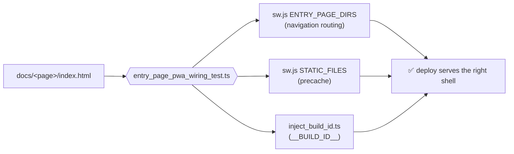

# Wire compare/ and sankey/ into the PWA plumbing (Issue #549)

## Summary

PR #548 added two entry pages, `docs/compare/` and `docs/sankey/`, but
registered neither in the PWA plumbing. The Service Worker's navigation routing
knew only `graph`, `starfield`, `dag` and `subgraph`, so a navigation to
`/compare/` was answered with the **root Explorer shell**, whose relative asset
URLs then 404'd under `/compare/` — the unstyled, broken page in the issue. Both
pages were also absent from `STATIC_FILES` (no precache, no deploy invalidation)
and from `scripts/inject_build_id.ts`, so the literal `__BUILD_ID__` placeholder
shipped to production.

Changes:

- `docs/sw.js` — navigation routing is now data-driven from a single
  `ENTRY_PAGE_DIRS` list (replacing the hard-coded ternary chain), with
  `compare` and `sankey` registered; `STATIC_FILES` precaches both pages, their
  page-local assets, and the five shared modules they import (`candidate_views`,
  `sankey_flow`, `sankey_layout`, `sankey_responsive`, `viewbox_zoom`) which
  were also missing.
- `scripts/inject_build_id.ts` — both pages' `index.html` and `boot.js` added to
  the inject list.
- `tests/entry_page_pwa_wiring_test.ts` — new local quality gate. It
  **discovers** entry pages from the filesystem (any `docs/*/index.html`) and
  fails when a page is missing from the navigation routing, the precache list,
  or the build-ID inject list. A future page added without PWA wiring now fails
  `./quality.sh` and CI instead of deploying green.

Closes #549.

## Evidence

Reproduction and fix, captured through a real Service Worker with
`scripts/capture_issue_549_evidence.ts` (loads `/` so `sw.js` installs and takes
control, then navigates to each page _via_ the SW).

**Before** — `/compare/` served the root Explorer shell, unstyled and broken
(matches the issue screenshot):


**After** — `/compare/` serves its own shell:


**After** — `/sankey/` serves its own shell:


The three registration points a new entry page must satisfy:



All four gates failed against the pre-fix tree (TDD) and pass after it:

```text
SW navigation routes every docs/ entry page to its own shell (#549) ... FAILED
  navigating to /compare/ must serve ./compare/index.html
SW STATIC_FILES precaches every entry page and its local assets (#549) ... FAILED
  missing: ./compare/index.html, ./compare/boot.js, … ./sankey/zoom_pan.js
SW STATIC_FILES precaches shared modules imported by every entry page (#549) ... FAILED
  missing: ./shared/candidate_views.js, ./shared/sankey_flow.js, …
inject_build_id.ts rewrites every docs/ file carrying the placeholder (#549) ... FAILED
  still contain __BUILD_ID__: docs/compare/{boot.js,index.html}, docs/sankey/{boot.js,index.html}
```

`./quality.sh` passes cleanly: 1110 tests, 0 failed.

## Test Plan

Added `tests/entry_page_pwa_wiring_test.ts` (4 cases, all behaviour-driven —
they drive the real `sw.js` fetch handler and run the real
`inject_build_id.ts`):

- SW navigation routes every discovered entry page to its own shell.
- `STATIC_FILES` precaches every entry page and its page-local `.js`/`.css`.
- `STATIC_FILES` precaches every `./shared/` module those pages import.
- `inject_build_id.ts` rewrites every `docs/` file carrying `__BUILD_ID__`
  (seeded into a temp fixture tree), catching both missing and stale entries.

Modified `tests/pwa_test.ts` — the #218 case's hard-coded fixture list gained
the four new compare/sankey files so its temp tree still matches the script's
file list. No test was removed or weakened.

Added `scripts/capture_issue_549_evidence.ts` for the screenshots above.
