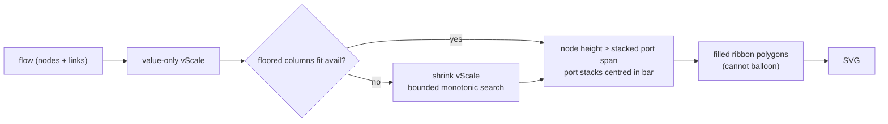

# PR Summary — Issue #552

## Summary

The Sankey contribution-flow page rendered garbled at phone width: ribbon bands
ballooned into lens/blob shapes, bands overlapped, spilled past the top of the
canvas, and did not line up with the node bars. The contribution values were
never in question — the fault was purely visual geometry.

Two faults in `computeSankeyGeometry` (`docs/shared/sankey_layout.js`) caused
it, and both are fixed:

1. **Floors ignored by the vertical scale and node heights.** Per-band and
   per-node thicknesses are floored at `layout.minBand` (3 px on a phone), but
   the shared vertical scale and the node heights were derived from raw
   contribution values alone. A hub whose bands all hit the floor stacked a port
   span far taller than its own bar and the 520 px phone canvas, so bands
   spilled out of their bars and off the top. The fix reconciles the floors with
   the scale: node heights now cover their stacked ports, and the vertical scale
   is shrunk by a bounded, monotonic search until **every** floored column fits
   the drawing area. Each node's port stack is centred within its bar so bands
   align with it, and the column start is clamped to the top padding so a still
   over-subscribed column extends down into the pannable canvas rather than
   spilling off the top.
2. **Stroked cubic centre-lines balloon.** Bands were single open cubic curves
   stroked with `stroke-width = thickness`, which balloon into lens/blob shapes
   once the stroke nears the column gap. They are now **filled ribbon polygons**
   (a top edge and a bottom edge, each a cubic, closed with `Z`), whose
   thickness is exact at both ends and cannot balloon. The renderer
   (`docs/sankey/sankey.js`) now fills the ribbon instead of stroking a
   centre-line, and the CSS drops `fill: none`.

The phone view is additionally simplified per the accepted scope: coarser
folding (`maxNodesPerLayer` 6 → 5) so each band is taller and its label
survives. The desktop layout is unchanged.

Fixes #552.

## Evidence

Rendered on the published default snapshot at an iPhone-14 viewport (390 px) via
a headless Chromium (Playwright) capture. The bands are thin, filled ribbons
that line up with the node bars; nothing balloons, overlaps into blobs, or
spills past the top of the canvas, and the family labels (`228 minor p…`,
`volume`, `dividend`, `treasury`, `EMVMACROFIN…`) are legible.

## Test Plan

Added `tests/sankey_layout_test.ts`, which builds the geometry directly for a
hub-heavy flow (a dominant path beside a tiny multi-band hub — the exact
imbalance the real snapshot produces). Each test fails against the unfixed
geometry and passes after the fix:

- `no node's bar or bands overflow the canvas` — every node stays within
  `[0, viewHeight]` at phone and desktop widths.
- `every band fits inside both node bars it connects` — a band's source/target
  edges sit within each connected bar's vertical extent (bands line up with the
  bars).
- `the sum of a node's inbound bands never exceeds its bar height` — the hub
  overflow regression.
- `bands are filled ribbon polygons, not stroked centre-lines` — the path is a
  closed shape with a top and bottom cubic edge.
- `bands still carry a positive thickness and endpoints` — floor and endpoint
  invariants preserved.

The existing `tests/sankey_responsive_test.ts` (including "geometry stays inside
the view box it declares" and the label-visibility assertions) continues to
pass, adapting to the new `maxNodesPerLayer` via its parameterised checks. Full
`./quality.sh` passes (`deno fmt`, `deno lint`, `deno check`, `deno test -A` —
1115 tests, 0 failures).
